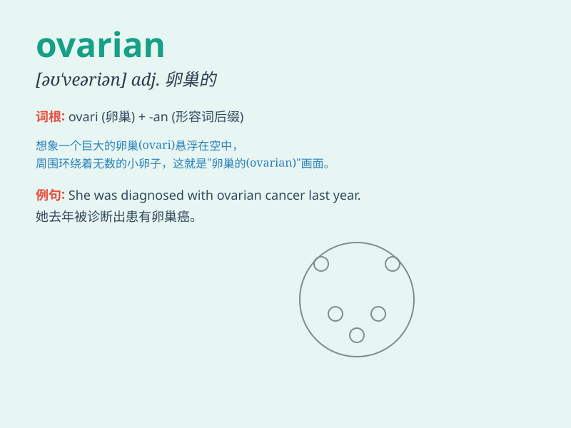

## ovarian

**英音:** _[əʊ\'veərɪən]_ **美音:** _[o\'vɛrɪən]_

**译义:** *adj.[植]子房的,[解]卵巢的*

### 短语

+ **ovarian cancer:** _卵巢癌_

+ **ovarian cyst:** _卵巢囊肿_

+ **ovarian follicle:** _卵巢滤泡_

+ **ovarian function:** _卵巢功能_

+ **ovarian hormone:** _卵巢激素_

### 例句

#### 例句1

> **The doctor is an expert in ovarian diseases.**

**中文翻译:** 医生是卵巢疾病方面的专家。

**单词释义:** 卵巢的

#### 例句2

> **Ovarian cancer is a serious health problem for many women.**

**中文翻译:** 卵巢癌对许多女性来说是一个严重的健康问题。

**单词释义:** 卵巢的

#### 例句3

> **She underwent surgery to remove the ovarian cyst.**

**中文翻译:** 她接受了卵巢囊肿切除手术。

**单词释义:** 卵巢的

### 背诵小故事

> A beautiful fairy named Ova was in charge of the garden in the
ovarian realm. She took good care of all the plants and flowers there,
making the place full of vitality.

**有个美丽的仙女叫奥瓦，她负责卵巢领域的花园。她悉心照料那里所有的植物和花朵，让这个地方充满生机。**

### 图义

