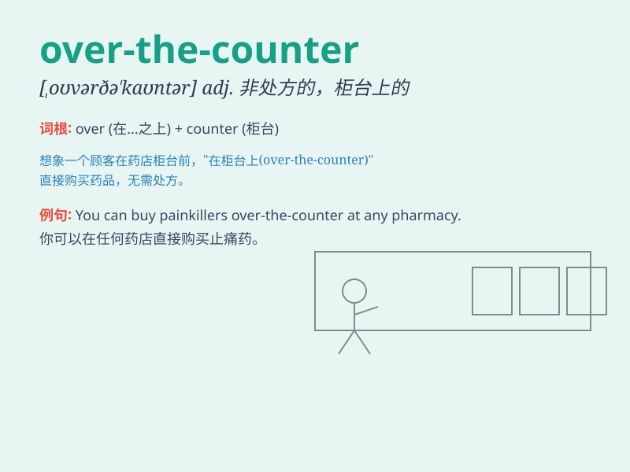

## over-the-counter

**英音:** _[ˌəʊvə ðə ˈkaʊntə(r)]_ **美音:** _[ˌoʊvər ðə
ˈkaʊntər]_

**译义:**
*adj.（药品等）无需处方可买到的；（证券等）不通过交易所直接卖给买方的*

### 短语

+ **over-the-counter drug:** _非处方药_

+ **over-the-counter market:** _场外交易市场_

+ **over-the-counter trade:** _场外交易_

+ **over-the-counter sale:** _柜台销售_

+ **over-the-counter business:** _场外业务_

### 例句

#### 例句1

> **You can buy some over-the-counter painkillers at the
pharmacy.**

**中文翻译:** 你可以在药店买到一些非处方药的止痛药。

**单词释义:** 非处方的

#### 例句2

> **The over-the-counter market for stocks is quite active.**

**中文翻译:** 股票的场外交易市场相当活跃。

**单词释义:** 场外交易的

#### 例句3

> **She got some over-the-counter cold medicine to relieve her
symptoms.**

**中文翻译:** 她买了一些非处方感冒药来缓解症状。

**单词释义:** 非处方的

### 背诵小故事

> 想象一下，你走进一家药店，店员告诉你有些药放在柜台上面（over the
counter），无需处方就能买到，这就是 over-the-counter，意思是非处方的。

**想象你走进药店，店员说有些药放在柜台上无需处方就能买，这就是'非处方的'的意思**

### 图义

