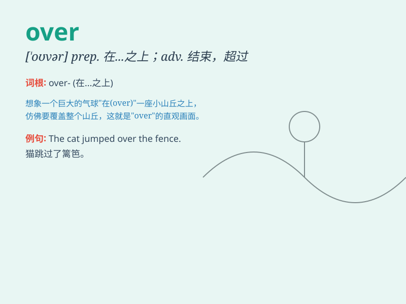

## over

**英音:** _[\'əʊvə]_ **美音:** _[\'ovɚ]_

**译义:** *adv.结束,越过,从头到尾
prep.在\...之上,越过adj.上面的vt.额外的东西,越过n.额外的东西*

### 短语

+ **over and over:** _一再地；反复不断地_

+ **all over:** _到处；遍及_

+ **over there:** _在那里_

+ **over time:** _随着时间的过去；超时_

+ **hand over:** _交出；移交_

### 例句

#### 例句1

> **The plane flew over the mountains.**

**中文翻译:** 飞机飞过群山。

**单词释义:** 越过；在......之上

#### 例句2

> **She is over fifty years old.**

**中文翻译:** 她已经五十多岁了。

**单词释义:** 超过

#### 例句3

> **The meeting is over.**

**中文翻译:** 会议结束了。

**单词释义:** 结束

### 背诵小故事

> A little bird was flying over a beautiful garden. It looked down and
saw many colorful flowers. \'Over\' here means above and across. The
bird flew over the garden happily.

**一只小鸟正在飞过一个美丽的花园。它向下看，看到了许多五颜六色的花。这里的'over'意思是在......上方且越过。小鸟开心地飞过了花园。**

### 图义

