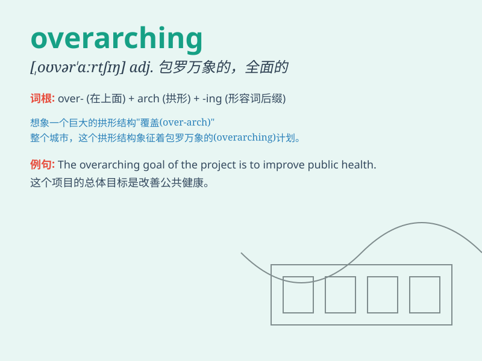

## overarching

**英音:** _[ˌəʊvərˈɑːtʃɪŋ]_ **美音:** _[ˌoʊvərˈɑːrtʃɪŋ]_

**译义:** *adj.首要的；支配一切的；包罗万象的*

### 短语

+ **overarching goal:** _首要目标_

+ **overarching theme:** _中心主题_

+ **overarching framework:** _总体框架_

+ **overarching concern:** _首要关注_

+ **overarching principle:** _首要原则_

### 例句

#### 例句1

> **The overarching goal of this project is to improve the
environment.**

**中文翻译:** 这个项目的首要目标是改善环境。

**单词释义:** 首要的；支配一切的

#### 例句2

> **There is an overarching theme of love and forgiveness in the
novel.**

**中文翻译:** 这部小说有一个关于爱与宽恕的总体主题。

**单词释义:** 总体的；全面的

#### 例句3

> **The overarching policy has a significant impact on our daily
lives.**

**中文翻译:** 这项总体政策对我们的日常生活有重大影响。

**单词释义:** 统领的；支配性的

### 背诵小故事

> 想象一个巨大的彩虹桥，它跨越了整个城市，连接了所有的角落，这就是
overarching。就像这桥笼罩一切，overarching 意味着首要的、支配一切的。

**想象一个巨大的彩虹桥跨越城市，象征'首要的、支配一切的'含义，辅助记忆
overarching 这个单词。**

### 图义

