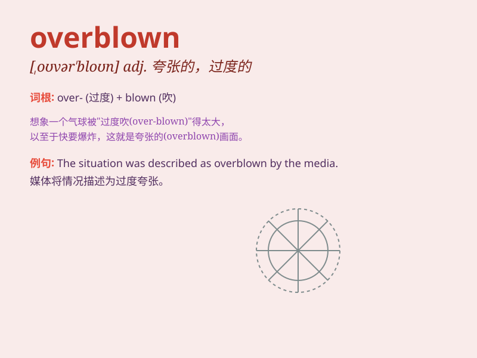

## overblown

**英音:** _[əʊvə\'bləʊn]_ **美音:** _[,ovɚ\'blon]_

**译义:** *adj.停息的,盛开过的*

### 短语

+ **overblown claim:** _夸大的主张_

+ **overblown rhetoric:** _夸张的言辞_

+ **overblown ego:** _过度膨胀的自我_

+ **overblown budget:** _超支的预算_

+ **overblown story:** _夸张的故事_

### 例句

#### 例句1

> **The media\'s coverage of the event was overblown.**

**中文翻译:** 媒体对这一事件的报道有些夸大其词。

**单词释义:** 夸大的；过分渲染的

#### 例句2

> **His fears about the exam were overblown; he did very well.**

**中文翻译:** 他对考试的恐惧被夸大了。他做得很好。

**单词释义:** 过分的；夸张的

#### 例句3

> **The description of the problem seemed overblown to me.**

**中文翻译:** 对我来说，问题的描述似乎有些过分了。

**单词释义:** 言过其实的；虚夸的

### 背诵小故事

> A king had a huge balloon. But he kept pumping air into it. Soon, the
balloon was overblown and burst. It means something being exaggerated or
made too big.

**一位国王有一个巨大的气球。但他不停地往里面打气。很快，气球过度膨胀然后爆开了。这意味着某物被夸大或做得太大。**

### 图义

