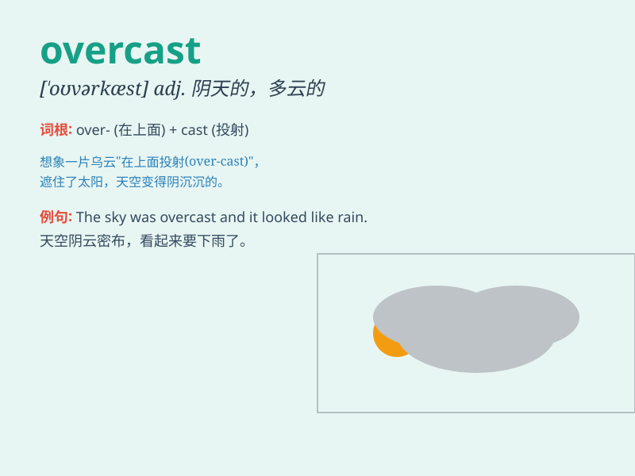

## overcast

**英音:** _[\'əʊvəkɑːst]_ **美音:** _[,ovɚ\'kæst]_

**译义:**
*n.覆盖,多云的天adj.阴天的,阴暗的,愁闷的,忧郁的vt.使阴暗vi.阴暗起来*

### 短语

+ **overcast sky:** _阴天的天空_

+ **overcast day:** _阴天_

+ **overcast weather:** _阴天的天气_

+ **become overcast:** _变得阴沉_

+ **remain overcast:** _保持阴沉_

### 例句

#### 例句1

> **The sky was overcast and it looked like it was going to rain.**

**中文翻译:** 天空乌云密布，看起来要下雨了。

**单词释义:** 阴天的；多云的

#### 例句2

> **Her mood was overcast by the bad news.**

**中文翻译:** 这个坏消息让她的心情变得阴沉。

**单词释义:** 忧郁的；阴沉的

#### 例句3

> **The overcast conditions made it difficult to take good
photos.**

**中文翻译:** 阴天的天气很难拍出好的照片。

**单词释义:** 阴天的；阴暗的

### 背诵小故事

> 一天，小明计划去公园野餐，但出门后发现天空
overcast（阴天的），乌云密布。他担心会下雨，心情也变得有些低落。最后他只能取消野餐，回家了。

**一天，小明计划去公园野餐，但出门后发现天空是阴天的，乌云密布。他担心会下雨，心情也变得有些低落。最后他只能取消野餐，回家了。**

### 图义

