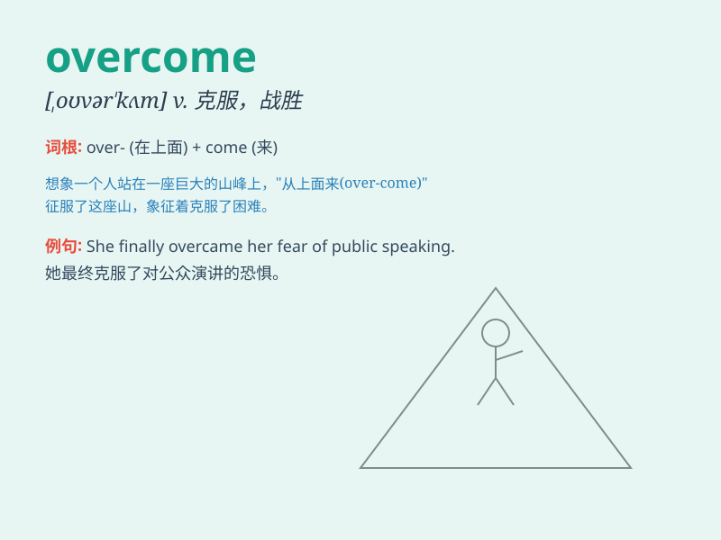

## overcome

**英音:** _[əʊvə\'kʌm]_ **美音:** _[,ovɚ\'kʌm]_

**译义:** *vt.战胜,克服,胜过,征服vi.得胜*

### 短语

+ **overcome difficulties:** _克服困难_

+ **overcome obstacles:** _克服障碍_

+ **overcome challenges:** _战胜挑战_

+ **overcome fears:** _克服恐惧_

+ **overcome weaknesses:** _克服弱点_

### 例句

#### 例句1

> **She managed to overcome her fear of heights.**

**中文翻译:** 她设法克服了恐高症。

**单词释义:** 战胜；克服

#### 例句2

> **The team overcame many difficulties to win the championship.**

**中文翻译:** 球队克服重重困难夺得冠军。

**单词释义:** 战胜；克服

#### 例句3

> **He was finally overcome by exhaustion and had to lie down.**

**中文翻译:** 终于，他精疲力尽，不得不躺下。

**单词释义:** 被（感情等）压倒

### 背诵小故事

> A brave climber was trying to reach the peak of a mountain. There
were many difficulties like strong winds and steep paths. But he didn\'t
give up and finally overcame all the obstacles and made it to the top.

**一位勇敢的登山者试图到达山顶。有许多困难，比如强风和陡峭的道路。但他没有放弃，最终克服了所有的障碍并成功登顶。**

### 图义

