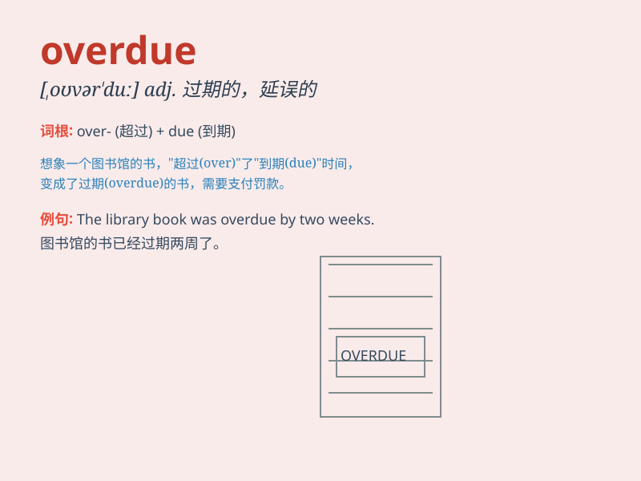

## overdue

**英音:** _[əʊvə\'djuː]_ **美音:** _[ovɚ\'du]_

**译义:** *adj.迟到的*

### 短语

+ **overdue payment:** _逾期付款_

+ **overdue library book:** _逾期未还的图书馆书籍_

+ **overdue invoice:** _逾期发票_

+ **overdue loan:** _逾期贷款_

+ **overdue subscription:** _逾期订阅_

### 例句

#### 例句1

> **The library book is overdue and I need to return it as soon as
possible.**

**中文翻译:** 图书馆的书已逾期，我需要尽快归还。

**单词释义:** 逾期的

#### 例句2

> **The payment for the electricity bill is overdue. We must settle
it immediately.**

**中文翻译:** 电费逾期未缴。我们必须立即解决。

**单词释义:** 逾期的；过期未付的

#### 例句3

> **The project\'s completion is overdue. We have to speed up the
process.**

**中文翻译:** 该项目已逾期完成。我们必须加快这一进程。

**单词释义:** 逾期的；延误的

### 背诵小故事

> The library sent a notice saying my book was overdue. I had forgotten
to return it on time and now I had to pay a fine. \'Overdue\' means past
the expected or proper time.

**图书馆发来通知说我的书逾期未还。我忘记按时归还了，现在得交罚款。\'overdue\'意思是超过了预期或恰当的时间。**

### 图义

