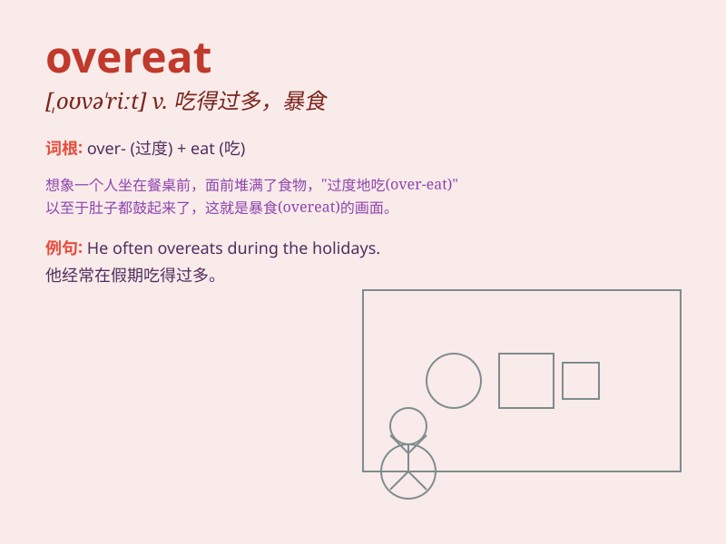

## overeat

**英音:** _[əʊvər\'iːt]_ **美音:** _[\'ovɚ\'it]_

**译义:** *vt.使吃过量vi.吃得过多*

### 短语

+ **overeat oneself:** _吃得过多_

+ **tend to overeat:** _倾向于过度进食_

+ **habitually overeat:** _习惯性地暴饮暴食_

+ **stop overeating:** _停止过度进食_

+ **be prone to overeat:** _容易暴饮暴食_

### 例句

#### 例句1

> **I tend to overeat when I\'m stressed.**

**中文翻译:** 当我有压力时，我往往会吃得过多。

**单词释义:** 吃得过多

#### 例句2

> **If you overeat regularly, it can lead to health problems.**

**中文翻译:** 如果经常吃得过多，可能会导致健康问题。

**单词释义:** 吃得过多

#### 例句3

> **He realized he had overeaten at the party and felt
uncomfortable.**

**中文翻译:** 他意识到自己在聚会上吃得太多，感到不舒服。

**单词释义:** 吃得过多

### 背诵小故事

> One day, a little bear was so happy at a picnic that he overate. He
ate too much honey and cakes. Later, his stomach hurt badly. From then
on, he knew not to overeat again.

**有一天，一只小熊在野餐时太开心了，于是就吃得过多。他吃了太多的蜂蜜和蛋糕。后来，他的肚子疼得厉害。从那以后，他知道不能再暴饮暴食了。**

### 图义

