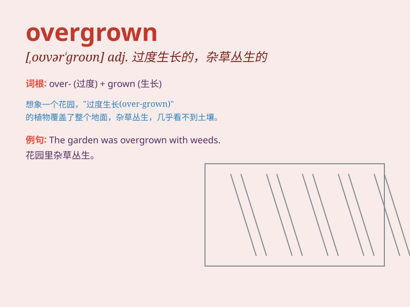

## overgrown

**英音:** _[əʊvə\'grəʊn; \'əʊvəgrəʊn]_ **美音:**
_[,ovɚ\'ɡron]_

**译义:** *adj.簇叶从生的,长得太大,畸形发展的*

### 短语

+ **overgrown garden:** _杂草丛生的花园_

+ **overgrown path:** _长满杂草的小路_

+ **overgrown forest:** _杂草蔓生的森林_

+ **overgrown beard:** _过长的胡须_

+ **overgrown nails:** _过长的指甲_

### 例句

#### 例句1

> **The garden was overgrown with weeds.**

**中文翻译:** 花园里杂草丛生。

**单词释义:** 长满；被......覆盖

#### 例句2

> **The path was overgrown and difficult to follow.**

**中文翻译:** 这条路杂草丛生，难以行走。

**单词释义:** 长满；被......阻塞

#### 例句3

> **The old house was overgrown with ivy.**

**中文翻译:** 老房子长满了常春藤。

**单词释义:** 被......布满

### 背诵小故事

> A little rabbit found a path in the forest. But it was overgrown with
weeds and hard to walk through. The rabbit had to struggle to move
forward. Finally, it made it and saw a beautiful view.

**一只小兔子在森林里发现了一条小路。但它杂草丛生，很难走过去。小兔子不得不艰难地向前移动。最后，它成功了，看到了美丽的景色。**

### 图义

