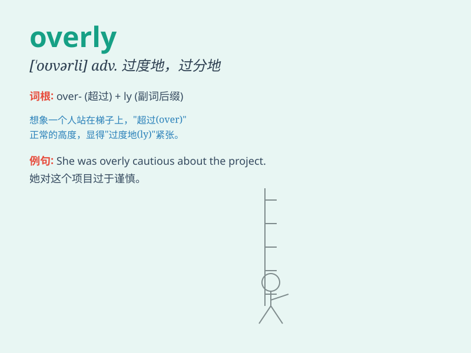

## overly

**英音:** _[\'əʊvəlɪ]_ **美音:** _[\'ovɚli]_

**译义:** *adv.过度地,极度地*

### 短语

+ **overly cautious:** _过于谨慎_

+ **overly sensitive:** _过于敏感_

+ **overly optimistic:** _过于乐观_

+ **overly critical:** _过于挑剔_

+ **overly dependent:** _过于依赖_

### 例句

#### 例句1

> **He is overly sensitive to criticism.**

**中文翻译:** 他对批评过于敏感。

**单词释义:** 过度地；过分地

#### 例句2

> **The dress is overly decorated with sequins.**

**中文翻译:** 这件衣服饰有过多的亮片。

**单词释义:** 过度地；过分地

#### 例句3

> **She is overly cautious when making decisions.**

**中文翻译:** 她做决定时过于谨慎。

**单词释义:** 过度地；过分地

### 背诵小故事

> Once upon a time, a little girl was overly excited when she saw a big
cake. She ate too much and felt sick. \'Overly\' means to an excessive
degree, more than is necessary or normal.

**从前，有个小女孩看到一个大蛋糕时过于兴奋。她吃得太多，感觉不舒服。'overly'意思是过度地，超出必要或正常的程度。**

### 图义

