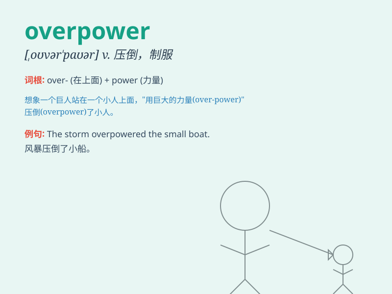

## overpower

**英音:** _[əʊvə\'paʊə]_ **美音:** _[\'ovɚ\'paʊɚ]_

**译义:** *vt.制服,压倒,供给\...过强的力量*

### 短语

+ **overpower an opponent:** _击败对手_

+ **be overpowered by emotion:** _被情感所压倒_

+ **overpower the defense:** _突破防御_

+ **overpower the resistance:** _克服阻力_

+ **overpower the temptation:** _抵制诱惑_

### 例句

#### 例句1

> **The wrestler easily overpowered his opponent.**

**中文翻译:** 摔跤手轻易地战胜了他的对手。

**单词释义:** 制服；压倒

#### 例句2

> **The smell of the flowers overpowered the stench from the
garbage.**

**中文翻译:** 花香盖过了垃圾的恶臭。

**单词释义:** 胜过；压过

#### 例句3

> **The new computer system overpowered the old one in terms of
performance.**

**中文翻译:** 新计算机系统在性能方面胜过了旧计算机系统。

**单词释义:** 超越；比\...更强大

### 背诵小故事

> A weak warrior was fighting a strong monster. The monster seemed
impossible to defeat. But suddenly, the warrior found a secret power and
used it to overpower the monster. With great strength, he finally won
the battle.

**一个弱小的战士正在和一个强大的怪物战斗。怪物似乎难以战胜。但突然，战士发现了一种神秘的力量并用它来制服怪物。凭借强大的力量，他最终赢得了战斗。**

### 图义

