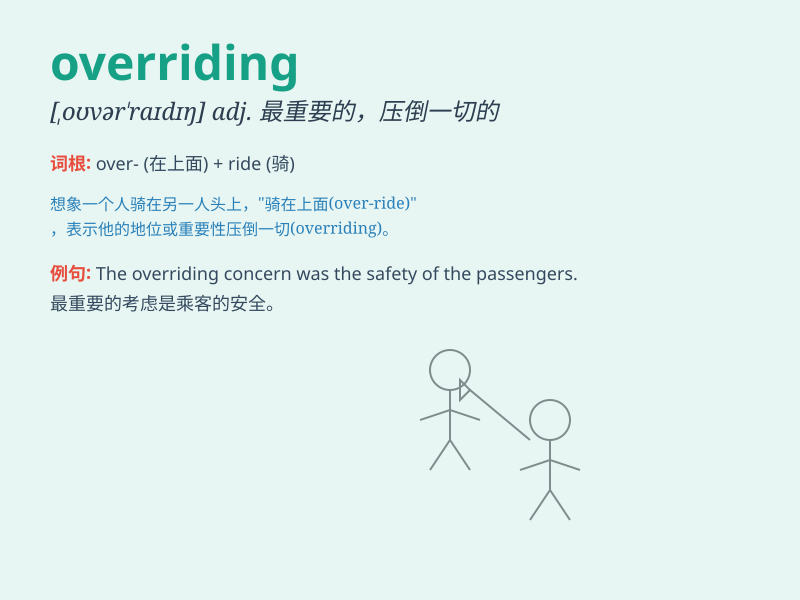

## overriding

**英音:** _[ˌəʊvəˈraɪdɪŋ]_ **美音:** _[ˌoʊvərˈraɪdɪŋ]_

**译义:** *adj. 至关重要的，压倒一切的；v.
驾驭（ride的现在分词形式），控制；优先于，超越（rule的现在分词形式）*

### 短语

+ **overriding concern:** _首要关注的问题_

+ **overriding objective:** _首要目标_

+ **overriding priority:** _最优先事项_

+ **overriding importance:** _极其重要_

+ **overriding passion:** _压倒一切的热情_

### 例句

#### 例句1

> **The overriding concern in this project is safety.**

**中文翻译:** 在这个项目中首要关注的是安全。

**单词释义:** 首要的；占优势的

#### 例句2

> **Her overriding ambition is to become a famous singer.**

**中文翻译:** 她的首要抱负是成为一名著名歌手。

**单词释义:** 最重要的；高于一切的

#### 例句3

> **The overriding factor in his decision was financial.**

**中文翻译:** 他做决定时的首要因素是经济方面的。

**单词释义:** 最重要的；压倒一切的

### 背诵小故事

>
想象一个国王正在下达命令，但一位拥有更大权力的王后突然出现，王后的意愿完全压倒了国王的命令，这就是\'overriding\'，表示最重要的、高于一切的。

**想象国王和王后的场景来辅助记忆\'overriding\'这个单词，意思是最重要的、高于一切的**

### 图义

