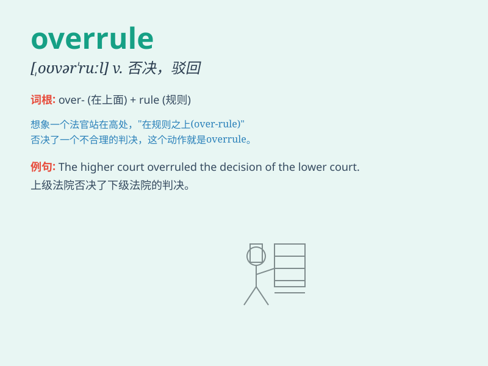

## overrule

**英音:** _[əʊvə\'ruːl]_ **美音:** _[,ovɚ\'rul]_

**译义:** *vt.驳回,否决,支配,制服*

### 短语

+ **overrule a decision:** _推翻一个决定_

+ **overrule an objection:** _驳回一项异议_

+ **be overruled by:** _被\...\...否决_

+ **overrule someone\'s claim:** _否定某人的主张_

+ **judicially overrule:** _司法上推翻_

### 例句

#### 例句1

> **The judge overruled the objection of the defense lawyer.**

**中文翻译:** 法官驳回了辩护律师的反对意见。

**单词释义:** 驳回；否决

#### 例句2

> **The board of directors overruled the manager\'s decision.**

**中文翻译:** 董事会否决了经理的决定。

**单词释义:** 推翻；否定

#### 例句3

> **His father\'s advice didn\'t overrule his own choice.**

**中文翻译:** 他父亲的建议并没有推翻他自己的选择。

**单词释义:** 左右；支配

### 背诵小故事

> The king had the power to overrule any decision made by his
ministers. One day, a minister suggested a bad policy. The king
overruled it and saved the kingdom.

**国王有权否决大臣们做出的任何决定。有一天，一位大臣提出了一项糟糕的政策。国王否决了它，拯救了王国。**

### 图义

