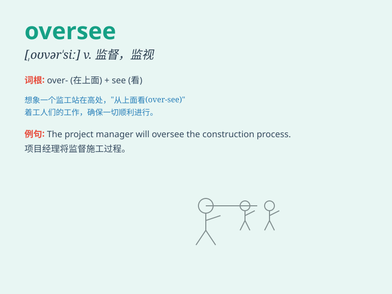

## oversee

**英音:** _[əʊvə\'siː]_ **美音:** _[\'ovɚ\'si]_

**译义:** *v.俯瞰,监视,检查,视察*

### 短语

+ **oversee the project:** _监督这个项目_

+ **oversee the construction:** _监督施工_

+ **oversee the operation:** _监督运营_

+ **oversee the production:** _监督生产_

+ **oversee the staff:** _监督员工_

### 例句

#### 例句1

> **The manager oversees the daily operations of the department.**

**中文翻译:** 经理负责监督部门的日常运作。

**单词释义:** 监督；监管

#### 例句2

> **She was appointed to oversee the project until its
completion.**

**中文翻译:** 她被任命负责监督该项目直至完成。

**单词释义:** 监督；负责

#### 例句3

> **The committee oversees the allocation of funds.**

**中文翻译:** 该委员会监督资金的分配。

**单词释义:** 监管；掌管

### 背诵小故事

> A manager was responsible for overseeing the entire project. He had
to stand on a high platform to have a clear view of everything. \'Over\'
means above and \'see\' is to look. So, oversee means to supervise or
manage.

**一位经理负责监督整个项目。他得站在一个高台上才能清楚地看到一切。\'Over\'意思是在上面，\'see\'是看。所以，oversee
意思是监督，管理。**

### 图义

