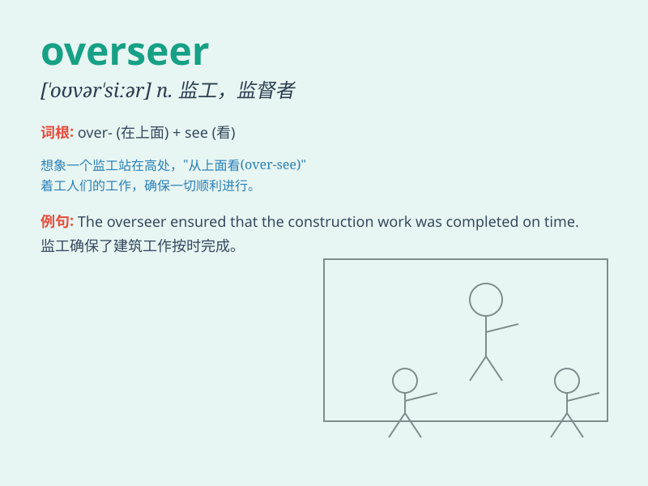

## overseer

**英音:** _[\'əʊvəsɪə]_ **美音:** _[\'ovɚsɪr]_

**译义:** *n.监督,工头*

### 短语

+ **plant overseer:** _工厂监工_

+ **worksite overseer:** _工地监督人_

+ **construction overseer:** _建筑监理_

+ **production overseer:** _生产主管_

+ **project overseer:** _项目监督者_

### 例句

#### 例句1

> **The overseer inspected the workers\' progress carefully.**

**中文翻译:** 监工仔细检查了工人们的进展情况。

**单词释义:** 监工

#### 例句2

> **The estate was managed by a strict overseer.**

**中文翻译:** 庄园由严格的监督人管理。

**单词释义:** 管理者

#### 例句3

> **The overseer ensured that the project was completed on time.**

**中文翻译:** 监工确保该项目按时完成。

**单词释义:** 监督者

### 背诵小故事

> A king had an overseer to manage his vast kingdom. The overseer was
responsible for watching over everything, making sure all was in order.
One day, a problem arose, but thanks to the overseer\'s vigilance, it
was quickly solved.

**一位国王有一个监管者来管理他广阔的王国。这个监管者负责监督一切，确保一切都井然有序。有一天，出现了一个问题，但多亏了监管者的警惕，问题很快就解决了。**

### 图义

