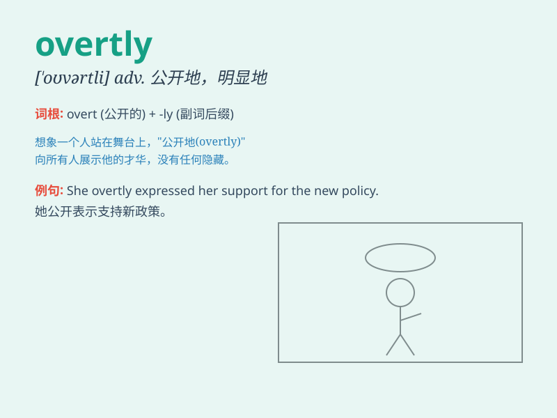

## overtly

**英音:** _[\'əʊvɜːtlɪ]_ **美音:** _[oʊ\'vɜːtlɪ]_

**译义:** *adv.公然地,公开地*

### 短语

+ **overtly critical:** _公然批评的_

+ **overtly aggressive:** _公然挑衅的_

+ **overtly political:** _公然政治化的_

+ **overtly sexual:** _公然性感的_

+ **overtly commercial:** _公然商业化的_

### 例句

#### 例句1

> **He overtly criticized the government\'s policies.**

**中文翻译:** 他公开批评政府的政策。

**单词释义:** 公开地

#### 例句2

> **The company overtly promoted its new product.**

**中文翻译:** 该公司公开宣传其新产品。

**单词释义:** 公开地

#### 例句3

> **She was overtly hostile towards me.**

**中文翻译:** 她对我表现出明显的敌意。

**单词释义:** 公然地

### 背诵小故事

> A spy was trying to gather secrets covertly. But one day, he was
caught and had to act overtly, admitting his mission in public. This
made his agency very angry.

**一名间谍一直试图秘密收集情报。但有一天，他被抓住了，不得不公开行事，在公众面前承认他的任务。这让他的机构非常生气。**

### 图义

