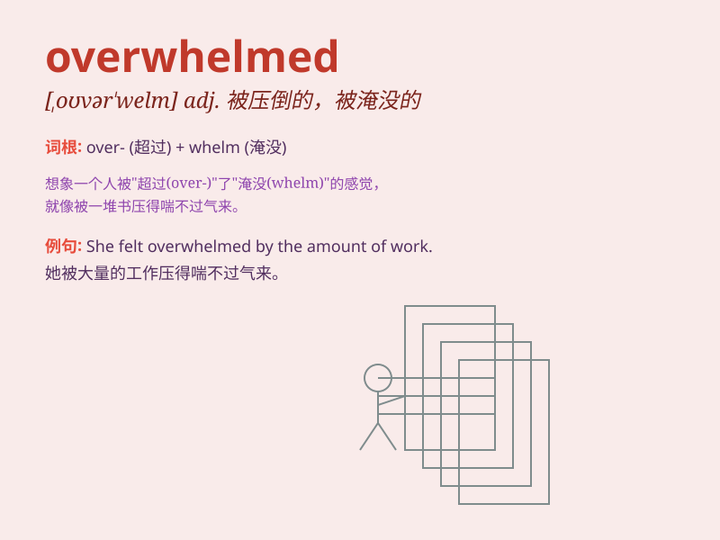

## overwhelmed

**英音:** _[ˌəʊvəˈwelm]_ **美音:** _[ˌoʊvərˈwelm]_

**译义:** *adj.感到压力极大的，不知所措的；被压垮的*

### 短语

+ **be overwhelmed with:** _被\...\...淹没；被\...\...压倒_

+ **feel overwhelmed:** _感到不知所措_

+ **overwhelmed by emotion:** _被情感淹没_

+ **overwhelmed with joy:** _欣喜若狂_

+ **overwhelmed with work:** _工作负担过重_

### 例句

#### 例句1

> **I was overwhelmed by the amount of work I had to do.**

**中文翻译:** 我被必须要做的工作量压垮了。

**单词释义:** 被（巨大的工作量）压垮，无法承受

#### 例句2

> **She was overwhelmed with joy when she heard the news.**

**中文翻译:** 当她听到这个消息时，她欣喜若狂。

**单词释义:** 被（喜悦）淹没，极度喜悦

#### 例句3

> **The small town was overwhelmed by the flood.**

**中文翻译:** 这个小镇被洪水淹没了。

**单词释义:** 被（洪水）淹没，覆盖

### 背诵小故事

>
想象你正在参加一场超级难的考试，题目多得像洪水一样涌来。你完全无法应对，被这巨大的压力和任务量所淹没，这种感觉就是
overwhelmed，就像被洪水淹没一样不知所措。

**想象在考试中被大量题目淹没无法应对的情景来理解'overwhelmed'，意思是不知所措、被淹没、应接不暇**

### 图义

