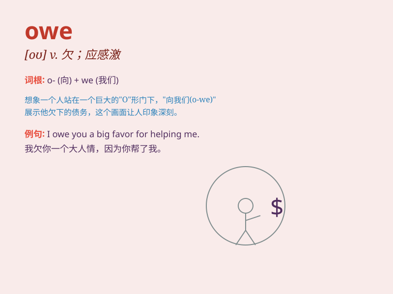

## owe

**英音:** _[əʊ]_ **美音:** _[o]_

**译义:**
*vt.欠(债等),受到\...的思想,感激,把\...归功于v.欠,应感激,应该把\...归功于(to)vi.欠钱*

### 短语

+ **owe money:** _欠钱_

+ **owe a debt:** _负债_

+ **owe someone an apology:** _应该向某人道歉_

+ **owe thanks to:** _多亏；感激_

+ **owe something to someone:** _把某事归功于某人_

### 例句

#### 例句1

> **I owe you an apology for my mistake.**

**中文翻译:** 我为我的错误向你道歉。

**单词释义:** 应该给予，欠（情）

#### 例句2

> **He owes a lot of money to the bank.**

**中文翻译:** 他欠银行很多钱。

**单词释义:** 欠（钱）

#### 例句3

> **We owe our success to hard work and good teamwork.**

**中文翻译:** 我们的成功归功于辛勤工作和良好的团队合作。

**单词释义:** 把......归功于

### 背诵小故事

> One day, Tom borrowed some money from his friend. Now he realizes he
owes his friend the money and must pay it back soon. He knows it\'s his
responsibility to do so.

**一天，汤姆从朋友那里借了些钱。现在他意识到自己欠朋友钱，必须尽快还。他知道这是他的责任。**

### 图义

