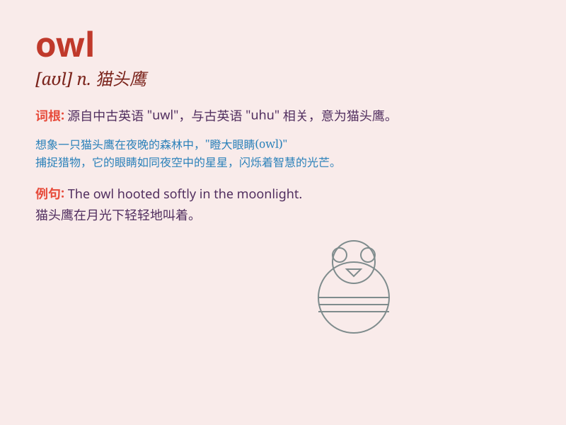

## owl

**英音:** _[aʊl]_ **美音:** _[aʊl]_

**译义:** *n.[动]猫头鹰,枭,惯于晚上活动的人 Object Window
Library,Borland C++ 的类库*

### 短语

+ **night owl:** _喜欢熬夜的人；夜猫子_

+ **snowy owl:** _雪鸮_

+ **burrowing owl:** _穴鸮_

+ **horned owl:** _角鸮_

+ **screech owl:** _鸣角鸮_

### 例句

#### 例句1

> **The owl hooted in the night.**

**中文翻译:** 猫头鹰在夜里发出叫声。

**单词释义:** 猫头鹰

#### 例句2

> **She saw an owl sitting on a branch.**

**中文翻译:** 她看到一只猫头鹰坐在树枝上。

**单词释义:** 猫头鹰

#### 例句3

> **The wise old owl gave good advice.**

**中文翻译:** 聪明的老猫头鹰给出了很好的建议。

**单词释义:** 猫头鹰

### 背诵小故事

> One night, a little boy was walking in the forest. Suddenly, he saw a
big owl. The owl had big eyes and was very quiet. It looked so
mysterious. The boy was both scared and curious about the owl.

**一天晚上，一个小男孩在森林里走着。突然，他看到一只大猫头鹰。猫头鹰有大大的眼睛，非常安静。它看起来很神秘。小男孩对这只猫头鹰既害怕又好奇。**

### 图义

