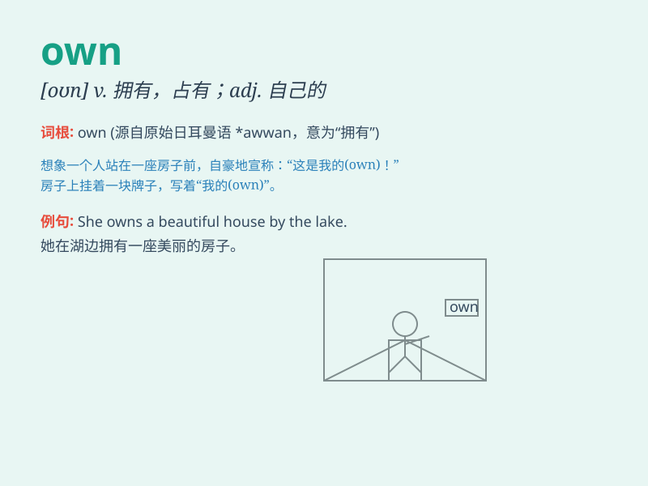

## own

**英音:** _[əʊn]_ **美音:** _[on]_

**译义:**
*adj.自己的,特有的,(不用所有格)嫡亲的,同胞的vt.拥有,自认,承认vi.承认*

### 短语

+ **on one\'s own:** _独自地；独立地_

+ **of one\'s own:** _属于某人自己的_

+ **own up:** _坦白；承认_

+ **own goal:** _（足球等运动中）乌龙球；无意中帮对方得分的进球_

+ **come into one\'s own:** _得到充分发挥；充分施展_

### 例句

#### 例句1

> **I own a beautiful house.**

**中文翻译:** 我拥有一栋漂亮的房子。

**单词释义:** 拥有

#### 例句2

> **She has her own car.**

**中文翻译:** 她有自己的车。

**单词释义:** 自己的

#### 例句3

> **He wants to solve the problem on his own.**

**中文翻译:** 他想自己解决问题。

**单词释义:** 独自

### 背诵小故事

> One day, Tom found a special pen and he claimed, \'This is my own
pen!\' It made him feel proud and happy. He knew that \'own\' means to
have something as yours exclusively.

**一天，汤姆发现了一支特别的笔，他宣称：'这是我自己的笔！'这让他感到骄傲和开心。他知道了'own'意思是独属于你的拥有某物。**

### 图义

