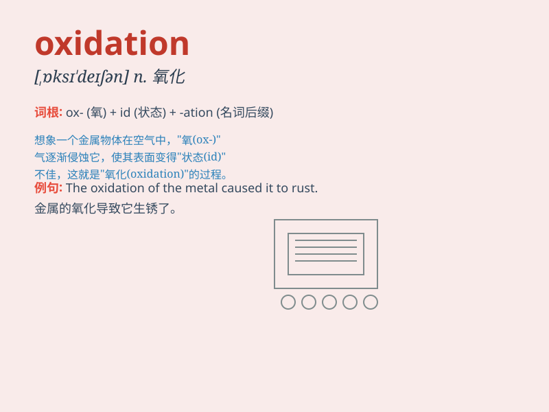

## oxidation

**英音:** _[ɒksɪ\'deɪʃ(ə)n]_ **美音:** _[,ɑksə\'deʃən]_

**译义:** *n.[化]氧化*

### 短语

+ **oxidation state:** _氧化态_

+ **oxidation process:** _氧化过程_

+ **oxidation number:** _氧化数_

+ **oxidation catalyst:** _氧化催化剂_

+ **oxidation resistance:** _抗氧化性_

### 例句

#### 例句1

> **The oxidation of iron causes rust.**

**中文翻译:** 铁的氧化会导致生锈。

**单词释义:** 氧化

#### 例句2

> **Oxidation is a chemical process that occurs frequently in
nature.**

**中文翻译:** 氧化是自然界中经常发生的化学过程。

**单词释义:** 氧化

#### 例句3

> **The wine undergoes oxidation and changes its flavor.**

**中文翻译:** 葡萄酒会发生氧化并改变其风味。

**单词释义:** 氧化

### 背诵小故事

> A brave chemist was exploring a mysterious cave. He found a strange
liquid that caused metals to rust rapidly. He realized this was
oxidation at work. The liquid made substances combine with oxygen,
changing their nature.

**一位勇敢的化学家正在探索一个神秘的洞穴。他发现了一种奇怪的液体，能使金属迅速生锈。他意识到这就是氧化作用在起作用。这种液体让物质与氧结合，改变了它们的性质。**

### 图义

