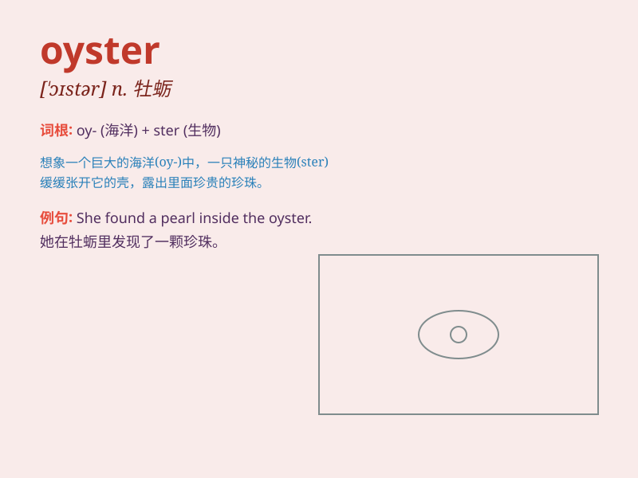

## oyster

**英音:** _[\'ɒɪstə]_ **美音:** _[\'ɔɪstɚ]_

**译义:** *n.[动]牡蛎,蚝,沉默者*

### 短语

+ **oyster bed:** _牡蛎养殖场_

+ **oyster mushroom:** _平菇；蚝蘑_

+ **oyster sauce:** _蚝油_

+ **oyster shell:** _牡蛎壳_

+ **pearl oyster:** _珍珠贝_

### 例句

#### 例句1

> **He enjoyed eating fresh oysters at the seaside restaurant.**

**中文翻译:** 他喜欢在海边餐厅吃新鲜的牡蛎。

**单词释义:** 牡蛎

#### 例句2

> **The pearl was found inside an oyster.**

**中文翻译:** 这颗珍珠是在牡蛎内发现的。

**单词释义:** 牡蛎

#### 例句3

> **She was as silent as an oyster about her private life.**

**中文翻译:** 她对自己的私生活保持沉默。

**单词释义:** 守口如瓶

### 背诵小故事

> A poor man was walking along the beach and found an oyster. He opened
it hoping for a pearl but got nothing. Disappointed, he threw it back.
But remember, an oyster can hold treasures inside!

**一个穷人沿着海滩散步，发现了一只牡蛎。他打开它希望找到珍珠，却一无所获。失望之下，他把它扔了回去。但要记住，牡蛎里面可能藏着宝藏！**

### 图义

