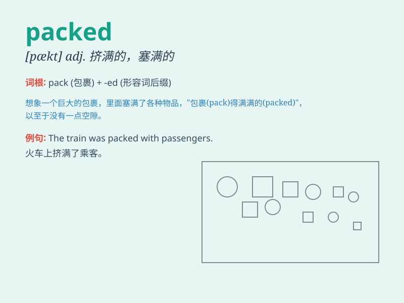

## packed

**英音:** _[pækt]_ **美音:** _[pækt]_

**译义:** *adj.挤满的,充满的;
v.包装,压紧,装箱,挤满,堆积,携带(行李),填满,挑选,塞满*

### 短语

+ **packed lunch:** _盒装午餐；自备的午餐_

+ **packed house:** _爆满的屋子；满座_

+ **packed train:** _拥挤的火车_

+ **be packed with:** _挤满；装满；充满_

+ **packed snow:** _压实的雪_

### 例句

#### 例句1

> **The stadium was packed with excited fans.**

**中文翻译:** 体育场里挤满了兴奋的球迷。

**单词释义:** 充满，挤满

#### 例句2

> **I packed my suitcase for the trip.**

**中文翻译:** 我为旅行收拾了行李箱。

**单词释义:** 收拾，打包

#### 例句3

> **The books were packed tightly in the box.**

**中文翻译:** 书被紧紧地装在箱子里。

**单词释义:** 包装，装填

### 背诵小故事

> I went to a concert. The venue was packed with people. I could hardly
move. It was so crowded that it felt like everyone was tightly packed
together like sardines in a can.

**我去了一场音乐会。场地里挤满了人。我几乎动不了。人多得就像罐头里的沙丁鱼一样紧紧地挤在一起。**

### 图义

