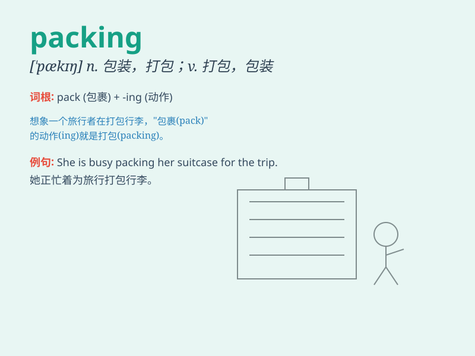

## packing

**英音:** _[\'pækɪŋ]_ **美音:** _[\'pækɪŋ]_

**译义:** *v.包装n.包装*

### 短语

+ **packing list:** _装箱单_

+ **packing material:** _包装材料_

+ **packing case:** _包装箱_

+ **packing machine:** _包装机_

+ **vacuum packing:** _真空包装_

### 例句

#### 例句1

> **The workers are busy with the packing of the products.**

**中文翻译:** 工人们正忙着对产品进行包装。

**单词释义:** 包装；打包

#### 例句2

> **I need to buy some packing materials for my move.**

**中文翻译:** 我需要为搬家购买一些包装材料。

**单词释义:** 包装材料

#### 例句3

> **The packing of this gift is very beautiful.**

**中文翻译:** 这件礼物的包装非常漂亮。

**单词释义:** 包装

### 背诵小故事

> A traveler was in a hurry, frantically doing the packing. He stuffed
clothes and shoes into the suitcase, making sure nothing was left
behind. Finally, with the packing done, he set off on his journey.

**一位旅行者很匆忙，疯狂地进行打包。他把衣服和鞋子塞进手提箱，确保没有落下任何东西。最后，打包完成，他踏上了旅程。**

### 图义

