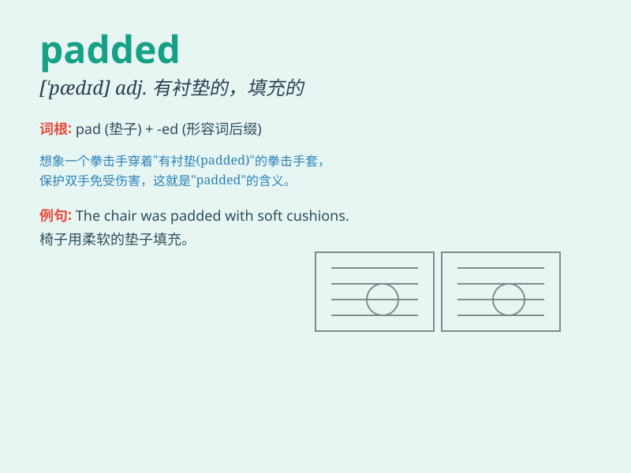

## padded

**英音:** _[ˈpædɪd]_ **美音:** _[ˈpædɪd]_

**译义:** *v.填补*

### 短语

+ **padded jacket:** _填充夹克；衬垫外套_

+ **padded cell:** _软垫病室；软壁病房_

+ **padded envelope:** _有衬垫的信封_

+ **padded seat:** _加垫座椅_

+ **padded bra:** _有衬垫的胸罩_

### 例句

#### 例句1

> **She wore a padded jacket to keep warm in the cold weather.**

**中文翻译:** 她穿着一件棉袄，以在寒冷的天气里保暖。

**单词释义:** 有衬垫的

#### 例句2

> **The chair has a padded seat for added comfort.**

**中文翻译:** 椅子配有软垫座椅，增加舒适度。

**单词释义:** 带衬垫的

#### 例句3

> **The athlete wore padded gloves during the boxing match.**

**中文翻译:** 该运动员在拳击比赛中戴着带衬垫的手套。

**单词释义:** 有衬垫的

### 背诵小故事

> A little bear was lost in the forest. It was cold and scared.
Luckily, it found a padded jacket. The soft padding made the bear warm
and it was no longer afraid. The padded jacket protected the little
bear.

**一只小熊在森林里迷路了。天气很冷，它很害怕。幸运的是，它找到了一件有衬垫的夹克。柔软的衬垫让小熊感到温暖，它不再害怕了。这件有衬垫的夹克保护了小熊。**

### 图义

