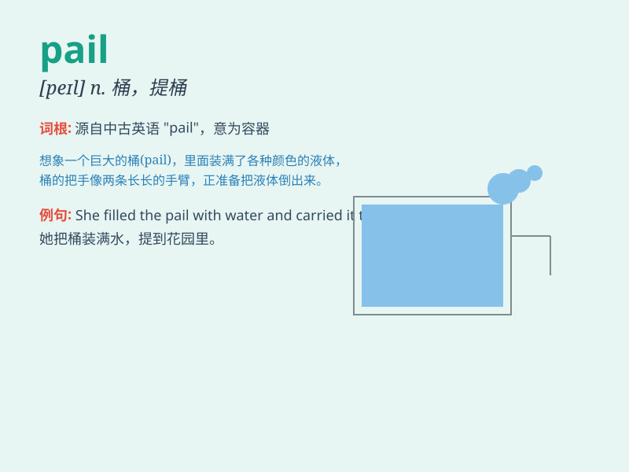

## pail

**英音:** _[peɪl]_ **美音:** _[pel]_

**译义:** *n.桶,提桶*

### 短语

+ **milk pail:** _牛奶桶_

+ **water pail:** _水桶_

+ **a pail of sand:** _一桶沙子_

+ **a pail of paint:** _一桶油漆_

+ **metal pail:** _金属桶_

### 例句

#### 例句1

> **She carried a pail of water from the well.**

**中文翻译:** 她从井里提了一桶水。

**单词释义:** 桶

#### 例句2

> **The milkman left a pail of fresh milk at the door.**

**中文翻译:** 送牛奶的人在门口留了一​​桶新鲜牛奶。

**单词释义:** 桶

#### 例句3

> **He filled the pail with sand for the children to play with.**

**中文翻译:** 他在桶里装满了沙子，让孩子们玩。

**单词释义:** 桶

### 背诵小故事

> One day, little Tom was sent by his mom to fetch water. He carried a
pail and walked to the well. With great effort, he filled the pail and
happily brought it home. The pail was heavy but Tom was proud.

**一天，小汤姆被妈妈派去打水。他提着一个桶走到水井边。费了好大劲，他把桶装满水，开心地提回了家。桶很重，但汤姆很自豪。**

### 图义

