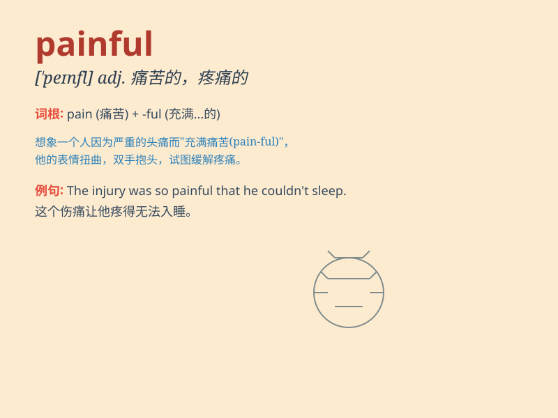

## painful

**英音:** _[\'peɪnfʊl; -f(ə)l]_ **美音:** _[\'penfl]_

**译义:** *adj.疼痛的,使痛苦的*

### 短语

+ **painful experience:** _痛苦的经历_

+ **painful memory:** _痛苦的回忆_

+ **painful decision:** _痛苦的决定_

+ **painful lesson:** _惨痛的教训_

+ **painful process:** _痛苦的过程_

### 例句

#### 例句1

> **The injection was painful.**

**中文翻译:** 注射很痛苦。

**单词释义:** 疼痛的

#### 例句2

> **It was a painful decision to make.**

**中文翻译:** 这是一个痛苦的决定。

**单词释义:** 痛苦的

#### 例句3

> **She had a painful experience during her trip.**

**中文翻译:** 她在旅途中经历过一段痛苦的经历。

**单词释义:** 痛苦的

### 背诵小故事

> One day, Tom had a bad toothache. Every bite he took was painful. He
couldn\'t enjoy his food. Even smiling became a painful task. Finally,
he went to the dentist to end this painful experience.

**一天，汤姆牙疼得厉害。每咬一口东西都很痛苦。他无法享受食物。甚至微笑都变成了一件痛苦的事。最后，他去看牙医来结束这段痛苦的经历。**

### 图义

