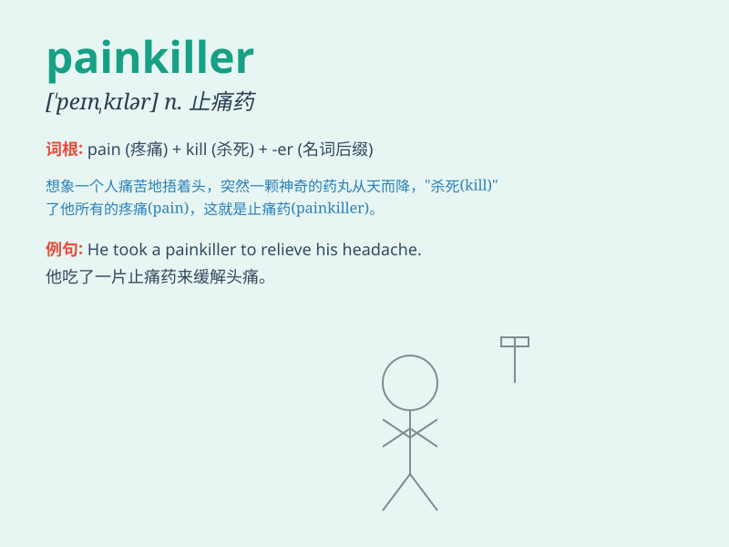

## painkiller

**英音:** _[\'peɪnkɪlə]_ **美音:** _[\'penkɪlɚ]_

**译义:** *n.\<美口>止痛药 解痛物*

### 短语

+ **strong painkiller:** _强效止痛药_

+ **natural painkiller:** _天然止痛药_

+ **prescription painkiller:** _处方止痛药_

+ **over-the-counter painkiller:** _非处方止痛药_

+ **effective painkiller:** _有效的止痛药_

### 例句

#### 例句1

> **The doctor prescribed a strong painkiller for my headache.**

**中文翻译:** 医生给我开了一种强效止痛药来治疗我的头痛。

**单词释义:** 止痛药

#### 例句2

> **After the surgery, she relied on painkillers to manage the
discomfort.**

**中文翻译:** 手术后，她依靠止痛药来缓解不适。

**单词释义:** 止痛药

#### 例句3

> **This new painkiller is said to have fewer side effects.**

**中文翻译:** 据说这种新的止痛药副作用较少。

**单词释义:** 止痛药

### 背诵小故事

> One day, Tom had a terrible toothache. The pain was unbearable.
Luckily, the doctor gave him a magic medicine - the painkiller. After
taking it, the pain vanished and Tom felt relieved.

**一天，汤姆牙疼得厉害。疼痛难以忍受。幸运的是，医生给了他一种神奇的药------止痛药。服用后，疼痛消失了，汤姆感到轻松了。**

### 图义

