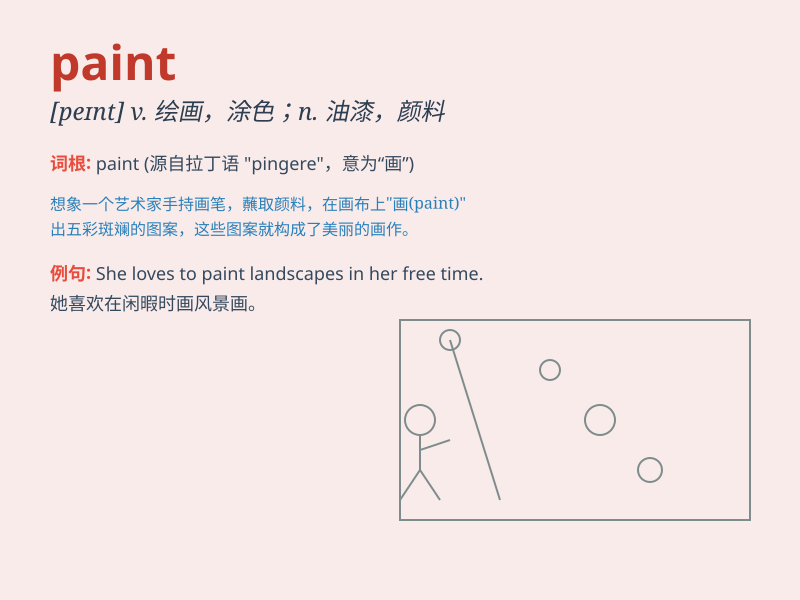

## paint

**英音:** _[peɪnt]_ **美音:** _[pent]_

**译义:** *n.油漆,颜料,涂料v.油漆,(用颜料等)画,绘,描绘,逼真地描述*

### 短语

+ **paint a picture:** _画一幅画_

+ **fresh paint:** _新涂的油漆_

+ **wall paint:** _墙漆_

+ **paint the town red:** _狂欢；尽情作乐_

+ **oil paint:** _油画颜料_

### 例句

#### 例句1

> **She loves to paint landscapes.**

**中文翻译:** 她喜欢画风景。

**单词释义:** 绘画；描绘

#### 例句2

> **I need to paint the wall white.**

**中文翻译:** 我需要把墙漆成白色。

**单词释义:** 给\...上油漆；涂饰

#### 例句3

> **The artist can paint a beautiful portrait.**

**中文翻译:** 艺术家可以画出一幅美丽的肖像。

**单词释义:** 作画；绘画

### 背诵小故事

> One day, a little artist was very happy. He had many colors and
brushes. He used them to paint a beautiful garden with colorful flowers.
The word \'paint\' means to use colors to make a picture.

**有一天，一个小艺术家非常开心。他有很多颜料和刷子。他用它们画了一个有着五颜六色花朵的美丽花园。单词\'paint\'的意思是用颜料作画。**

### 图义

