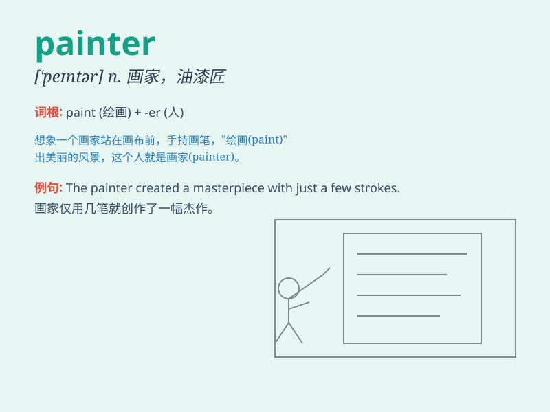

## painter

**英音:** _[\'peɪntə]_ **美音:** _[\'pentɚ]_

**译义:** *n.画家,油漆匠*

### 短语

+ **house painter:** _房屋油漆工_

+ **portrait painter:** _肖像画家_

+ **landscape painter:** _风景画家_

+ **master painter:** _绘画大师_

+ **amateur painter:** _业余画家_

### 例句

#### 例句1

> **The painter is working on a beautiful landscape.**

**中文翻译:** 画家正在描绘一幅美丽的风景。

**单词释义:** 画家

#### 例句2

> **She hired a professional painter to decorate her living room.**

**中文翻译:** 她聘请了一位专业油漆工来装饰她的客厅。

**单词释义:** 画家

#### 例句3

> **The painter\'s masterpiece was displayed in the museum.**

**中文翻译:** 画家的杰作陈列在博物馆里。

**单词释义:** 画家

### 背诵小故事

> A painter was very passionate. He spent days and nights in his
studio, using colors to express his emotions. One day, he created a
masterpiece that made everyone amazed. Remember, a painter is someone
who creates art with colors.

**一位画家非常有激情。他在工作室里日夜不停地创作，用色彩表达自己的情感。有一天，他创作了一幅让所有人都惊叹的杰作。记住，painter
就是用色彩创作艺术的人。**

### 图义

