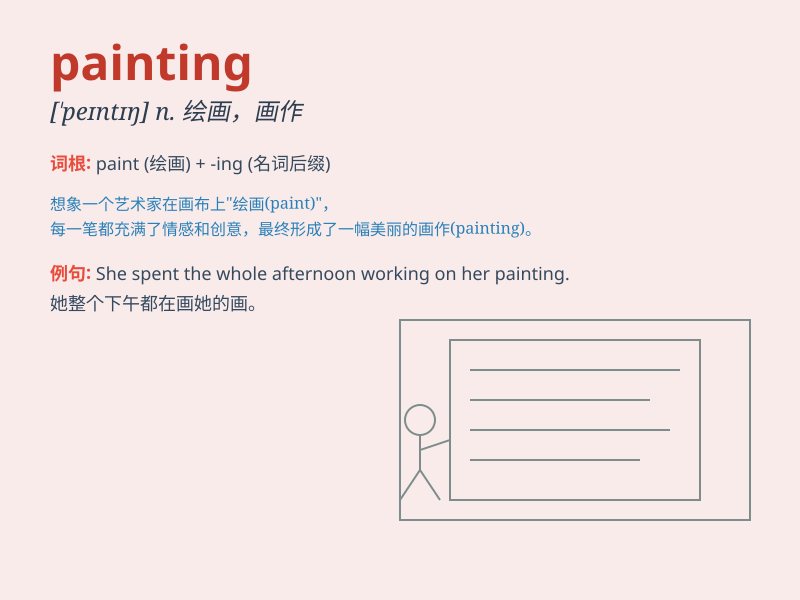

## painting

**英音:** _[\'peɪntɪŋ]_ **美音:** _[\'pentɪŋ]_

**译义:** *n.上油漆,着色,绘画,油画v.描绘*

### 短语

+ **oil painting:** _油画_

+ **landscape painting:** _风景画_

+ **portrait painting:** _肖像画_

+ **abstract painting:** _抽象画_

+ **wall painting:** _壁画_

### 例句

#### 例句1

> **I love the painting on the wall.**

**中文翻译:** 我喜欢墙上的画。

**单词释义:** 画；绘画作品

#### 例句2

> **She is good at oil painting.**

**中文翻译:** 她擅长油画。

**单词释义:** 绘画；油画

#### 例句3

> **The museum has a collection of famous paintings.**

**中文翻译:** 博物馆收藏有名画。

**单词释义:** 画作；绘画

### 背诵小故事

> One day, I went to an art gallery and saw a beautiful painting. It
was a landscape with colorful flowers and a blue sky. The artist used
amazing techniques to create this wonderful work. I was deeply attracted
by the painting and couldn\'t forget it.

**有一天，我去了一个美术馆，看到了一幅美丽的画。这是一幅有着五颜六色的花朵和蓝色天空的风景画。艺术家使用了惊人的技巧创作了这幅精彩的作品。我被这幅画深深吸引，难以忘怀。**

### 图义

