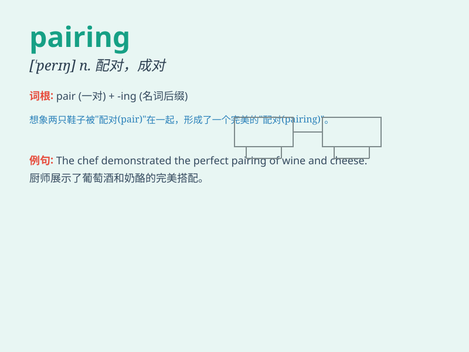

## pairing

**英音:** _[ˈpeərɪŋ]_ **美音:** _[ˈperɪŋ]_

**译义:** *n.配对,成对,配对物,耦合*

### 短语

+ **pairing off:** _成双成对；配对_

+ **pairing function:** _配对函数_

+ **pairing up:** _配成对；合作_

+ **chromosome pairing:** _染色体配对_

+ **pairing behavior:** _配对行为_

### 例句

#### 例句1

> **The wine pairing with this dish is perfect.**

**中文翻译:** 这道菜与这种葡萄酒的搭配非常完美。

**单词释义:** 搭配；配对

#### 例句2

> **The pairing of these two colors creates a bold effect.**

**中文翻译:** 这两种颜色的配对营造出一种大胆的效果。

**单词释义:** 配对；组合

#### 例句3

> **The pairing of dancers was done randomly.**

**中文翻译:** 舞者的配对是随机进行的。

**单词释义:** 配对；搭配

### 背诵小故事

> In a magical garden, every flower had its own pairing partner. They
danced together in the breeze. The pairing of these flowers was so
beautiful and harmonious. It made the garden a wonderful place.

**在一个神奇的花园里，每朵花都有自己的配对伙伴。它们一起在微风中跳舞。这些花的配对是如此美丽和谐。这使得花园成为一个美妙的地方。**

### 图义

