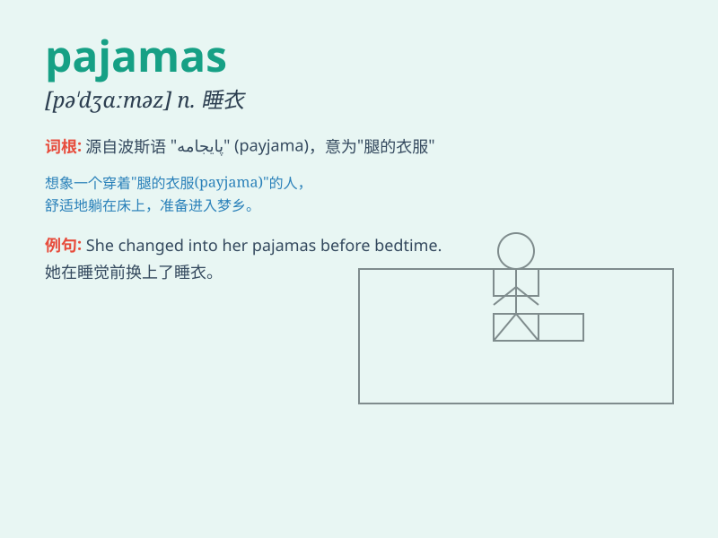

## pajamas

**英音:** _[pə\'dʒɑːməz]_ **美音:** _[pə\'dʒæməz]_

**译义:** *n.睡衣,宽长裤*

### 短语

+ **pair of pajamas:** _一套睡衣_

+ **silk pajamas:** _丝绸睡衣_

+ **flannel pajamas:** _法兰绒睡衣_

+ **wear pajamas:** _穿睡衣_

+ **children\'s pajamas:** _儿童睡衣_

### 例句

#### 例句1

> **I wore my new pajamas to bed last night.**

**中文翻译:** 昨晚我穿着我的新睡衣上床睡觉了。

**单词释义:** 睡衣

#### 例句2

> **She bought a pair of cute pajamas for her daughter.**

**中文翻译:** 她给她女儿买了一套可爱的睡衣。

**单词释义:** 睡衣

#### 例句3

> **The pajamas are made of soft cotton.**

**中文翻译:** 这套睡衣是用柔软的棉花制成的。

**单词释义:** 睡衣

### 背诵小故事

> One night, Tom was too tired to change into normal clothes. He just
wore his pajamas and went straight to bed. The soft and comfortable
pajamas made him sleep well.

**一天晚上，汤姆太累了以至于没换正常衣服。他就穿着睡衣直接上床睡觉了。柔软舒适的睡衣让他睡得很好。**

### 图义

