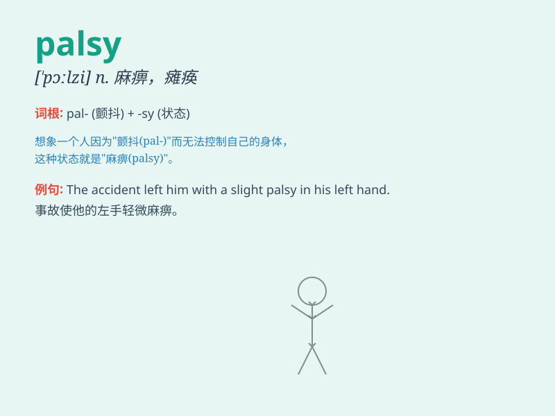

## palsy

**英音:** _[\'pɔːlzɪ; \'pɒl-]_ **美音:** _[\'pɔlzi]_

**译义:** *n.瘫痪*

### 短语

+ **cerebral palsy:** _脑性麻痹_

+ **facial palsy:** _面神经麻痹；面瘫_

+ **infantile palsy:** _小儿麻痹症_

+ **paralytic palsy:** _麻痹性瘫痪_

+ **general palsy:** _全身麻痹_

### 例句

#### 例句1

> **The accident left him with partial palsy in his left leg.**

**中文翻译:** 那场事故使他左腿部分瘫痪。

**单词释义:** 瘫痪

#### 例句2

> **She was diagnosed with palsy at a young age.**

**中文翻译:** 她在年轻时被诊断出患有瘫痪症。

**单词释义:** 瘫痪症

#### 例句3

> **The disease caused palsy of the facial muscles.**

**中文翻译:** 这种疾病导致了面部肌肉瘫痪。

**单词释义:** 瘫痪

### 背诵小故事

> A brave knight was fighting in a fierce battle. Suddenly, a
mysterious spell struck him, causing palsy in his right arm. But with
his strong will, he continued to fight. Remember, palsy means paralysis
or loss of control of body parts.

**一位勇敢的骑士正在激烈的战斗中拼杀。突然，一道神秘的咒语击中了他，导致他的右臂麻痹。但凭借坚强的意志，他继续战斗。记住，palsy
意思是麻痹或身体部分失去控制。**

### 图义

