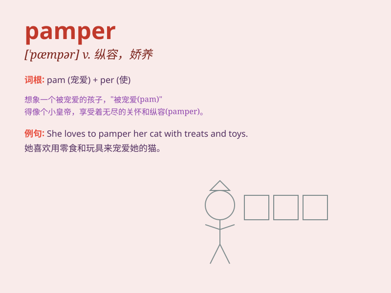

## pamper

**英音:** _[\'pæmpə]_ **美音:** _[\'pæmpɚ]_

**译义:** *v.纵容*

### 短语

+ **pamper oneself:** _放纵自己；尽情享受_

+ **pamper a child:** _娇惯孩子_

+ **be pampered:** _被纵容；被娇惯_

+ **pamper with food:** _用食物纵容_

+ **pamper to sb\'s needs:** _迎合某人的需求_

### 例句

#### 例句1

> **She pampered herself with a luxurious spa treatment.**

**中文翻译:** 她用豪华的水疗来纵容自己。

**单词释义:** 纵容；娇惯

#### 例句2

> **The parents always pamper their only child.**

**中文翻译:** 这对父母总是娇惯他们的独生子。

**单词释义:** 娇宠；溺爱

#### 例句3

> **Don\'t pamper your dog too much or it will become
disobedient.**

**中文翻译:** 别太宠你的狗，否则它会变得不听话。

**单词释义:** 宠爱；悉心照料

### 背诵小故事

> Once upon a time, there was a spoiled prince. His servants always
pampered him, giving him whatever he wanted. But when he faced real
challenges, he was helpless because he was too used to being pampered.

**从前，有一位被宠坏的王子。他的仆人们总是纵容他，给他想要的一切。但当他面临真正的挑战时，他却束手无策，因为他太习惯被纵容了。**

### 图义

