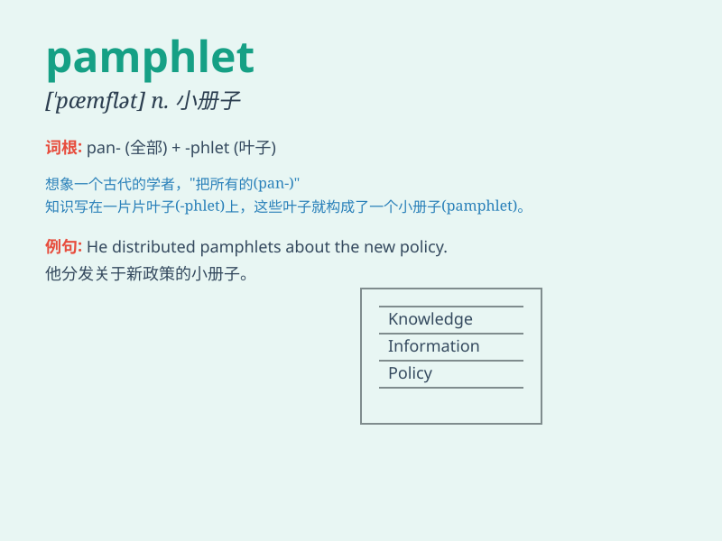

## pamphlet

**英音:** _[ˈpæmflət]_ **美音:** _[ˈpæmflət]_

**译义:** *n.小册子*

### 短语

+ **political pamphlet:** _政治小册子_

+ **informational pamphlet:** _信息手册_

+ **travel pamphlet:** _旅行手册_

+ **advertising pamphlet:** _广告宣传册_

+ **educational pamphlet:** _教育手册_

### 例句

#### 例句1

> **I picked up a pamphlet about local attractions.**

**中文翻译:** 我拿起了一本关于当地景点的小册子。

**单词释义:** 小册子

#### 例句2

> **The company distributed pamphlets to promote their new
product.**

**中文翻译:** 公司分发小册子来推广他们的新产品。

**单词释义:** 小册子

#### 例句3

> **She wrote a pamphlet on environmental protection.**

**中文翻译:** 她写了一本关于环境保护的小册子。

**单词释义:** 小册子

### 背诵小故事

> A traveler got lost in a strange town. Luckily, he found a pamphlet
at a corner store. It had clear maps and useful info that guided him.
The pamphlet was like a helpful friend in an unfamiliar place.

**一位旅行者在一个陌生的城镇迷路了。幸运的是，他在一家街角商店发现了一本小册子。里面有清晰的地图和有用的信息为他指引方向。这本小册子就像在陌生之地的一位乐于助人的朋友。**

### 图义

