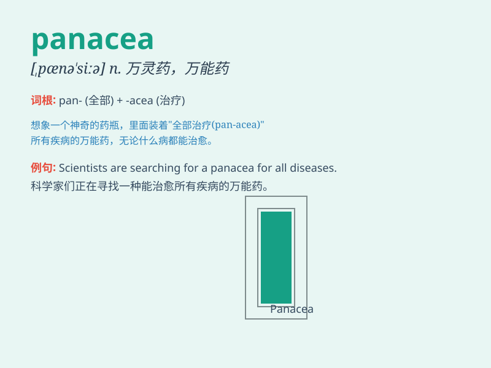

## panacea

**英音:** _[ˌpænəˈsiːə]_ **美音:** _[ˌpænəˈsiːə]_

**译义:** *n.万能药*

### 短语

+ **a panacea for:** _针对\...的万灵药_

+ **seek a panacea:** _寻求万灵药_

+ **offer a panacea:** _提供万灵药_

+ **believe in panacea:** _相信有万灵药_

+ **find a panacea:** _找到万灵药_

### 例句

#### 例句1

> **The new drug is not a panacea for all diseases.**

**中文翻译:** 这种新药并非能治愈所有疾病的万灵药。

**单词释义:** 能解决一切问题的万能药；灵丹妙药

#### 例句2

> **Some people believe that technology is a panacea for our
environmental problems.**

**中文翻译:** 一些人认为科技是解决我们环境问题的灵丹妙药。

**单词释义:** 能解决一切问题的万能办法

#### 例句3

> **There is no panacea that can solve all the economic issues
overnight.**

**中文翻译:** 不存在能一夜之间解决所有经济问题的万灵药。

**单词释义:** 解决所有问题的万能妙方

### 背诵小故事

>
从前有个村庄，人们深受各种疾病困扰。一位智者带来一种神奇的药水，宣称它是
panacea，能治愈所有病。大家尝试后，果然都恢复了健康。原来这神奇的药水就是万能药呀！

**从前有个村庄，人们深受各种疾病困扰。一位智者带来一种被宣称是能治愈所有病的万能药的神奇药水，大家尝试后都恢复了健康。**

### 图义

