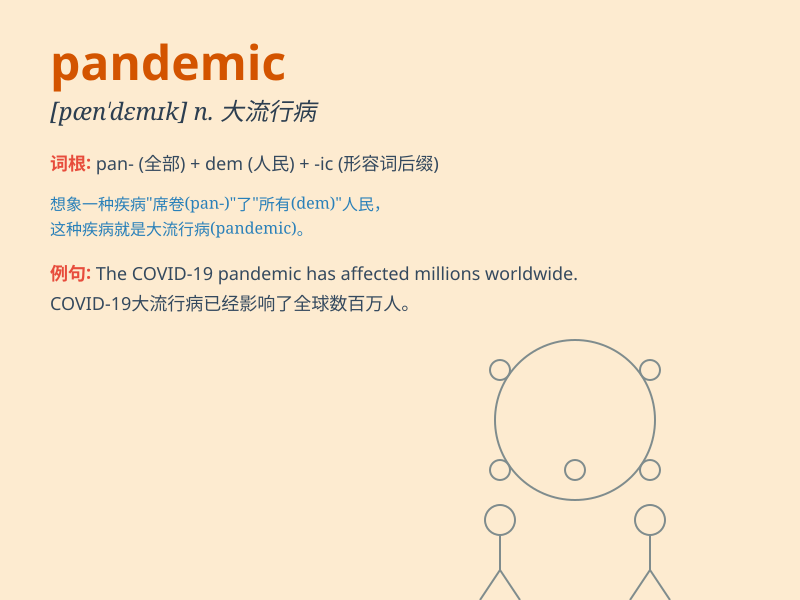

## pandemic

**英音:** _[pæn\'demɪk]_ **美音:** _[pæn\'dɛmɪk]_

**译义:** *adj.全国流行的*

### 短语

+ **pandemic disease:** _大流行病_

+ **pandemic prevention:** _大流行预防_

+ **global pandemic:** _全球大流行_

+ **pandemic situation:** _大流行形势_

+ **pandemic response:** _大流行应对_

### 例句

#### 例句1

> **The pandemic has caused widespread job losses.**

**中文翻译:** 这场大流行病导致了大范围的失业。

**单词释义:** 大规模流行的（疾病）

#### 例句2

> **We are still in the midst of a global pandemic.**

**中文翻译:** 我们仍处于全球大流行病之中。

**单词释义:** （疾病的）大流行

#### 例句3

> **The pandemic forced many schools to close.**

**中文翻译:** 这场大流行病迫使许多学校关闭。

**单词释义:** （疾病的）大流行

### 背诵小故事

>
想象一个世界，一种超级厉害的疾病到处传播，没有国家能躲开，所有人都受到威胁。这种疾病的广泛传播就叫
pandemic。就像一场全球性的大灾难，影响到每一个角落。

**想象一种疾病广泛传播，无人幸免，以此来理解'pandemic（大流行病；广泛流行的）'**

### 图义

