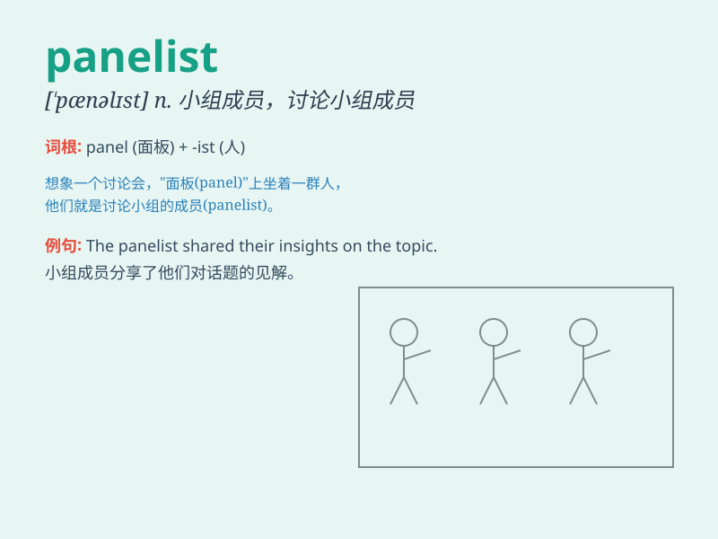

## panelist

**英音:** _[\'pænəlɪst]_ **美音:** _[\'pænlɪst]_

**译义:** *n.小组辩论,猜谜参加者*

### 短语

+ **expert panelist:** _专家小组成员_

+ **regular panelist:** _常任小组成员_

+ **guest panelist:** _嘉宾小组成员_

+ **professional panelist:** _专业小组成员_

+ **prominent panelist:** _杰出的小组成员_

### 例句

#### 例句1

> **The panelist made a thought-provoking point during the
discussion.**

**中文翻译:** 与会嘉宾在讨论中提出了一个发人深省的观点。

**单词释义:** 小组成员

#### 例句2

> **The panelist was an expert in the field of economics.**

**中文翻译:** 小组成员是经济学领域的专家。

**单词释义:** 小组成员

#### 例句3

> **The audience raised questions to the panelist.**

**中文翻译:** 观众向嘉宾提问。

**单词释义:** 小组成员

### 背诵小故事

> 想象一个盛大的讨论节目，台上坐着一群专家，他们被称为 panelist
。其中一位 panelist 提出了独特的观点，引发了热烈讨论。这些 panelist
就像智慧的使者，为大家带来精彩的见解。

**想象在一个讨论节目中，台上的专家被称为 panelist ，一位 panelist
提出独特观点引发讨论，他们像智慧使者带来精彩见解。**

### 图义

