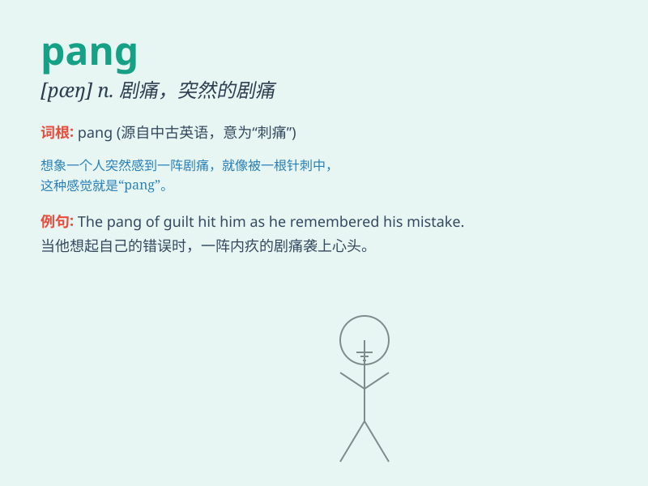

## pang

**英音:** _[pæŋ]_ **美音:** _[pæŋ]_

**译义:** *n.剧痛,悲痛vt.使剧痛*

### 短语

+ **pang of conscience:** _良心的谴责；内疚_

+ **pang of hunger:** _饥饿的剧痛_

+ **pang of love:** _爱情的痛苦_

+ **pang of grief:** _悲痛之苦_

+ **pang of remorse:** _悔恨的痛苦_

### 例句

#### 例句1

> **She felt a sudden pang of guilt when she saw the disappointed
look on his face.**

**中文翻译:** 看到他脸上失望的表情，她突然感到一阵愧疚。

**单词释义:** 一阵强烈的痛苦、内疚或情感

#### 例句2

> **The pang of hunger made him weak.**

**中文翻译:** 饥饿的折磨让他变得虚弱。

**单词释义:** （肉体上的）剧痛

#### 例句3

> **A pang of sadness shot through her heart as she remembered the
old days.**

**中文翻译:** 想起以前的日子，她的心里涌起一阵悲伤。

**单词释义:** （情感上的）突然的刺痛

### 背诵小故事

> A hungry man was walking in the forest and suddenly felt a pang in
his stomach. He realized he needed food urgently. The pang was so strong
that he had to find something to eat quickly.

**一个饥饿的男人在森林里走着，突然感到胃一阵剧痛。他意识到自己急需食物。这阵剧痛如此强烈，以至于他不得不赶快找点东西吃。**

### 图义

