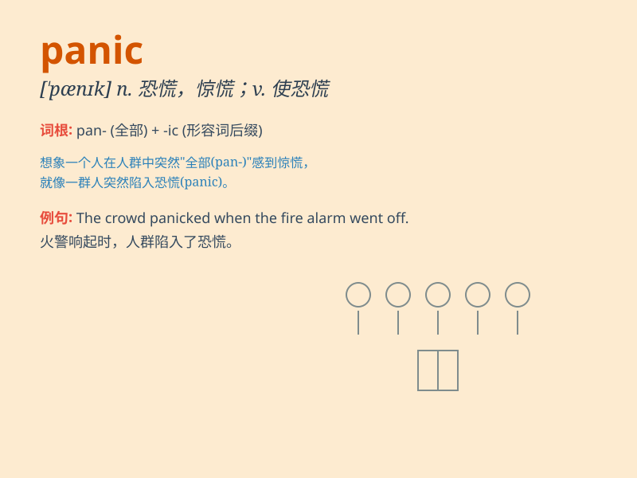

## panic

**英音:** _[\'pænɪk]_ **美音:** _[\'pænɪk]_

**译义:** *n.惊慌,恐慌,没有理由的*

### 短语

+ **panic attack:** _恐慌发作_

+ **panic buying:** _恐慌性抢购_

+ **panic button:** _应急按钮；紧急按钮_

+ **panic disorder:** _恐慌症；惊恐障碍_

+ **in panic:** _惊慌地；处于恐慌中_

### 例句

#### 例句1

> **The sudden noise caused panic among the crowd.**

**中文翻译:** 突如其来的响动，引起了人群的恐慌。

**单词释义:** 恐慌

#### 例句2

> **She was in a panic when she realized she had lost her keys.**

**中文翻译:** 当她意识到自己丢了钥匙时，她惊慌失措。

**单词释义:** 恐慌

#### 例句3

> **The stock market crash led to widespread panic.**

**中文翻译:** 股市崩盘引发了普遍的恐慌。

**单词释义:** 恐慌

### 背诵小故事

> One day, a little rabbit was walking in the forest. Suddenly, a
fierce tiger appeared. The rabbit was in a panic and didn\'t know where
to run. It was so scared that its heart was beating fast.

**一天，一只小兔子正在森林里散步。突然，一只凶猛的老虎出现了。小兔子惊慌失措，不知道往哪里跑。它非常害怕，心跳得很快。**

### 图义

