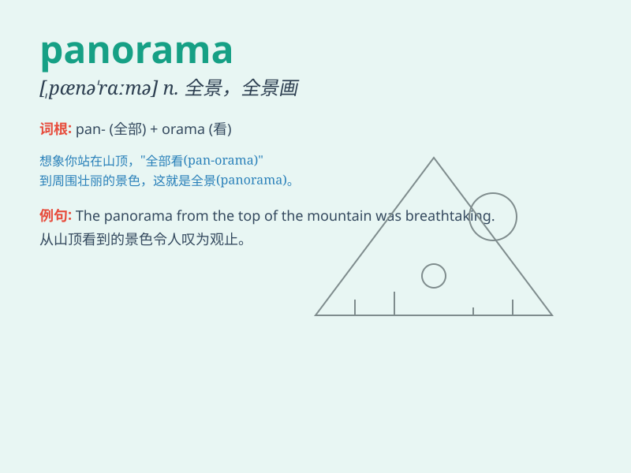

## panorama

**英音:** _[pænə\'rɑːmə]_ **美音:** _[,pænə\'ræmə]_

**译义:** *n.全景 全景画,全景摄影*

### 短语

+ **panoramic view:** _全景；全景图；全景视野_

+ **panoramic camera:** _全景照相机_

+ **panoramic screen:** _全景屏幕_

+ **panoramic painting:** _全景画_

+ **panoramic photograph:** _全景照片_

### 例句

#### 例句1

> **The panorama from the top of the mountain was breathtaking.**

**中文翻译:** 山顶的全景令人叹为观止。

**单词释义:** 全景；全貌

#### 例句2

> **The film presented a panorama of life in the 19th century.**

**中文翻译:** 影片展现了19世纪的生活全景。

**单词释义:** 全貌；综合景观

#### 例句3

> **The city\'s panorama changed dramatically over the past
decade.**

**中文翻译:** 过去十年里，这座城市的面貌发生了巨大的变化。

**单词释义:** 全景；全貌

### 背诵小故事

>
想象一下，你站在山顶，眼前展开一幅巨大的画卷（pan），那是整个山脉的景色（orama），没有任何阻挡，这就是全景（panorama），一幅完整而壮观的景象。

**想象你站在山顶看到的完整壮观的山脉景色，来辅助记忆单词'panorama'（全景）的意思**

### 图义

