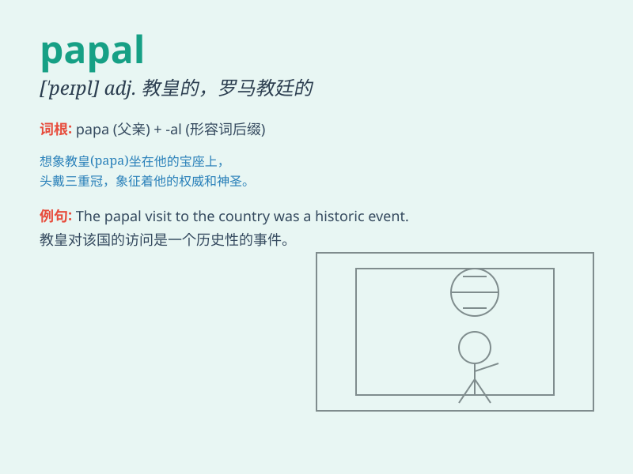

## papal

**英音:** _[\'peɪp(ə)l]_ **美音:** _[\'pepl]_

**译义:** *adj.罗马教皇的,教皇制度的*

### 短语

+ **papal authority:** _教皇权威_

+ **papal bull:** _教皇诏书_

+ **papal legate:** _教皇使节_

+ **papal visit:** _教皇访问_

+ **papal decree:** _教皇法令_

### 例句

#### 例句1

> **The papal visit attracted huge crowds.**

**中文翻译:** 教皇的访问吸引了大批群众。

**单词释义:** 教皇的；罗马教皇的

#### 例句2

> **He received a papal blessing.**

**中文翻译:** 他得到了教皇的祝福。

**单词释义:** 教皇的；罗马教皇的

#### 例句3

> **The papal decree was highly controversial.**

**中文翻译:** 教皇的法令引起了很大争议。

**单词释义:** 教皇的；罗马教皇的

### 背诵小故事

> A young monk dreamed of meeting the papal. One day, he traveled far
and finally saw the papal in a grand ceremony. The papal\'s presence was
so majestic and left a deep impression on him.

**一个年轻的僧侣梦想见到教皇。有一天，他长途跋涉，终于在一场盛大的仪式上见到了教皇。教皇的出现是如此威严，给他留下了深刻的印象。**

### 图义

