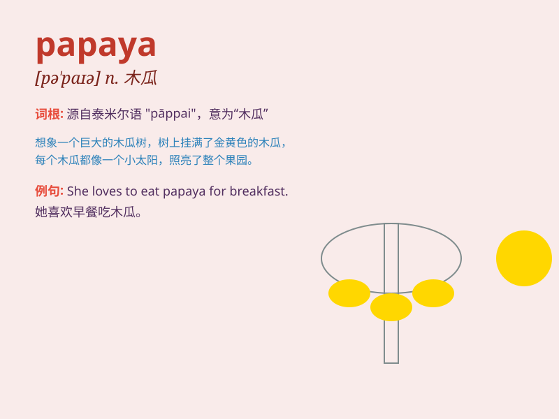

## papaya

**英音:** _[pə\'paɪə]_ **美音:** _[pə\'paɪə]_

**译义:** *n.番木瓜树,番木瓜果*

### 短语

+ **papaya juice:** _木瓜汁_

+ **papaya salad:** _木瓜沙拉_

+ **ripe papaya:** _成熟的木瓜_

+ **green papaya:** _青木瓜_

+ **papaya tree:** _木瓜树_

### 例句

#### 例句1

> **I love the taste of papaya in smoothies.**

**中文翻译:** 我喜欢冰沙中木瓜的味道。

**单词释义:** 木瓜

#### 例句2

> **The papaya tree in our garden is bearing fruit.**

**中文翻译:** 我们花园里的木瓜树正在结果。

**单词释义:** 木瓜

#### 例句3

> **She cut up a papaya for breakfast.**

**中文翻译:** 她切了一个木瓜当早餐。

**单词释义:** 木瓜

### 背诵小故事

> A monkey climbed up a tree and found a big papaya. It was so excited
and shared it with its friends. They ate the sweet papaya together and
had a great time.

**一只猴子爬上树，发现了一个大木瓜。它非常兴奋，并和朋友们分享。它们一起吃了甜甜的木瓜，度过了愉快的时光。**

### 图义

