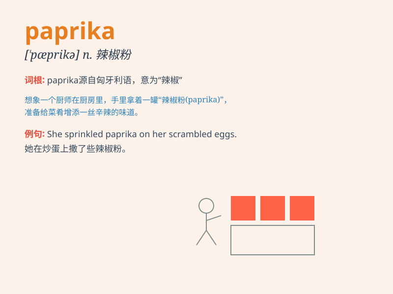

## paprika

**英音:** _[\'pæprɪkə]_ **美音:** _[pə\'priːkə;
pə\'prikə]_

**译义:** *n.红辣椒,辣椒粉*

### 短语

+ **sweet paprika:** _甜椒粉_

+ **hot paprika:** _辣椒粉_

+ **paprika powder:** _红椒粉_

+ **smoked paprika:** _熏制辣椒粉_

+ **ground paprika:** _辣椒粉（粉末状）_

### 例句

#### 例句1

> **The dish was seasoned with paprika for a hint of spiciness.**

**中文翻译:** 这道菜用辣椒粉调味，带有一点辣味。

**单词释义:** 辣椒粉

#### 例句2

> **She sprinkled some paprika on the fried potatoes.**

**中文翻译:** 她在炸土豆上撒了些辣椒粉。

**单词释义:** 辣椒粉

#### 例句3

> **The chef added a pinch of paprika to enhance the flavor of the
soup.**

**中文翻译:** 厨师加了一小撮辣椒粉来提升汤的味道。

**单词释义:** 辣椒粉

### 背诵小故事

> A chef was making a special dish and needed paprika. But he couldn\'t
find it. He searched everywhere until he finally discovered it hidden
behind other spices. With the paprika, the dish became delicious and
everyone loved it.

**一位厨师正在做一道特别的菜，需要辣椒粉（paprika）。但他找不到。他到处找，直到最后发现它藏在其他香料后面。有了辣椒粉，这道菜变得美味可口，大家都喜欢。**

### 图义

