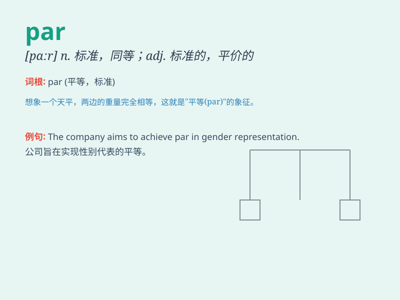

## par

**英音:** _[pɑː]_ **美音:** _[pɑr]_

**译义:**
*n.同等,(股票等)票面价值adj.票面的,平价的,平均的,标准的,*

### 短语

+ **par for the course:** _意料之中；平常_

+ **below par:** _低于标准；在平均水平以下_

+ **up to par:** _达到标准；合格_

+ **on a par with:** _与\...同等；和\...一样_

+ **par excellence:** _出类拔萃的；卓越的_

### 例句

#### 例句1

> **The golf course is of championship par.**

**中文翻译:** 这个高尔夫球场是达到锦标赛标准的标准杆数。

**单词释义:** 标准杆数

#### 例句2

> **He always tries to keep his expenses at par.**

**中文翻译:** 他总是努力把开支保持在正常水平。

**单词释义:** 标准；正常水平

#### 例句3

> **The shares are trading at par.**

**中文翻译:** 这些股票按面值交易。

**单词释义:** 票面价值；平价

### 背诵小故事

> A parrot was flying in a park. It landed on a par bench and started
to sing. People were amazed by its beautiful voice. \'Par\' means equal
or standard in this case, just like the bench in the park is a common
standard one.

**一只鹦鹉在公园里飞。它落在一张普通的长椅上开始唱歌。人们被它美妙的声音所惊艳。在这个例子中，\'par\'意思是相等的或标准的，就像公园里的长椅是常见的标准款。**

### 图义

