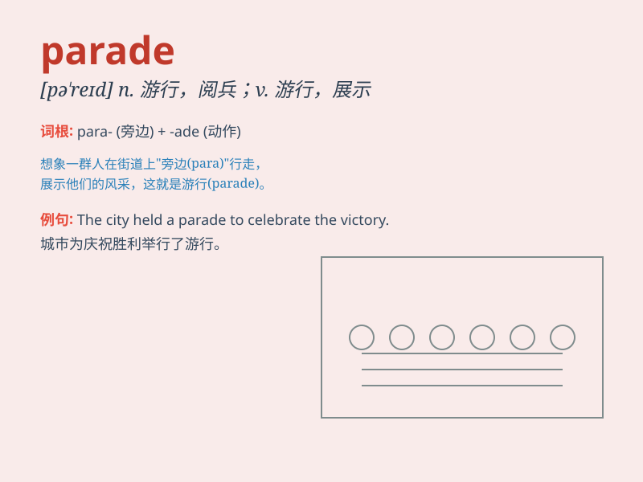

## parade

**英音:** _[pə\'reɪd]_ **美音:** _[pə\'red]_

**译义:**
*n.游行,炫耀,阅兵,检阅,阅兵场v.游行,炫耀,夸耀,(使)列队行进*

### 短语

+ **military parade:** _军事阅兵_

+ **parade ground:** _阅兵场_

+ **on parade:** _在游行；在接受检阅_

+ **parade of strength:** _力量的展示_

+ **victory parade:** _胜利游行_

### 例句

#### 例句1

> **The soldiers paraded through the city.**

**中文翻译:** 士兵们在城市中列队游行。

**单词释义:** 列队行进；游行

#### 例句2

> **The floats paraded along the main street.**

**中文翻译:** 彩车沿着主街游行。

**单词释义:** 列队行进；游行

#### 例句3

> **She paraded her new dress in front of her friends.**

**中文翻译:** 她在朋友面前炫耀她的新裙子。

**单词释义:** 炫耀；展示

### 背诵小故事

> A group of kids were excited to join the parade. They wore colorful
clothes and held balloons. They marched along the street, smiling and
waving to the people. The parade was full of joy and fun.

**一群孩子兴奋地参加游行。他们穿着五颜六色的衣服，拿着气球。他们沿着街道行进，微笑着向人们挥手。这场游行充满了欢乐和乐趣。**

### 图义

