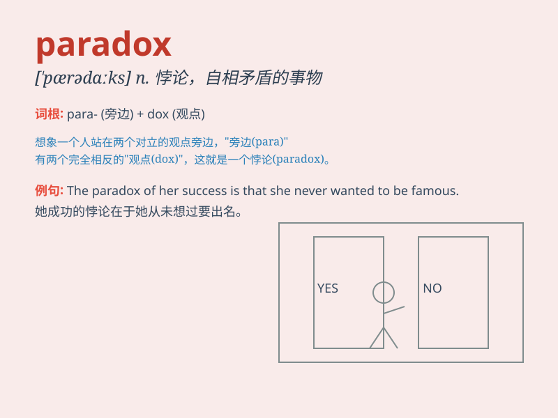

## paradox

**英音:** _[\'pærədɒks]_ **美音:** _[\'pærədɑks]_

**译义:** *n.似非而是的论点,自相矛盾的话*

### 短语

+ **the paradox of thrift:** _节约悖论_

+ **paradox of value:** _价值悖论_

+ **paradox of plenty:** _资源丰富悖论_

+ **growth paradox:** _增长悖论_

+ **paradox of choice:** _选择悖论_

### 例句

#### 例句1

> **The paradox of our time is that we have more knowledge but less
wisdom.**

**中文翻译:** 我们这个时代的悖论是我们拥有更多的知识但却更少的智慧。

**单词释义:** 悖论；自相矛盾的情况

#### 例句2

> **It\'s a paradox that the more we communicate, the less we seem to
understand each other.**

**中文翻译:** 这是一个悖论，我们交流得越多，似乎彼此理解得越少。

**单词释义:** 自相矛盾的事物

#### 例句3

> **The paradox of freedom is that it requires discipline.**

**中文翻译:** 自由的悖论在于它需要纪律。

**单词释义:** 矛盾的情况

### 背诵小故事

> One day, a philosopher encountered a strange phenomenon. Something
seemed both true and false at the same time. He called it a paradox. It
was like a mystery that challenged common sense.

**一天，一位哲学家遇到了一个奇怪的现象。某事看起来既真实又虚假。他把这称为悖论。这就像是一个挑战常识的谜团。**

### 图义

