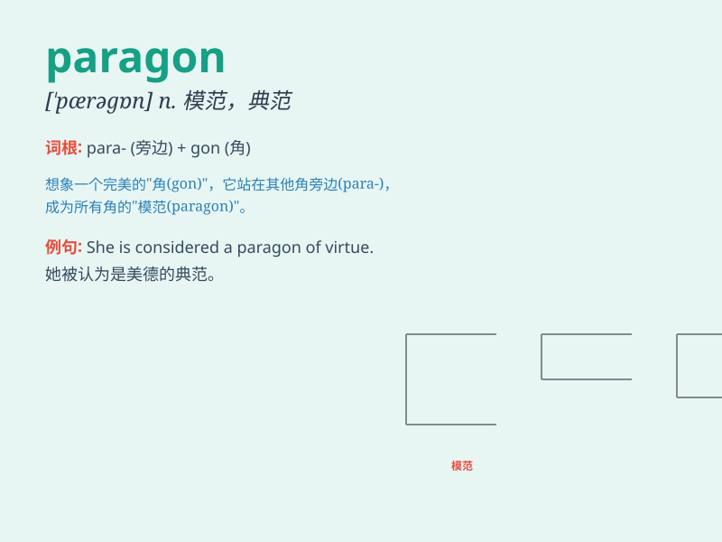

## paragon

**英音:** _[\'pærəg(ə)n]_ **美音:** _[\'pærəɡɑn]_

**译义:** *n.模范*

### 短语

+ **a paragon of virtue:** _美德的典范_

+ **paragon of beauty:** _美的典范_

+ **paragon of excellence:** _卓越的典范_

+ **a literary paragon:** _文学典范_

+ **a paragon of patience:** _耐心的典范_

### 例句

#### 例句1

> **She is considered a paragon of beauty and intelligence.**

**中文翻译:** 她被认为是美丽与智慧的典范。

**单词释义:** 典范；完美的榜样

#### 例句2

> **The new car is a paragon of fuel efficiency.**

**中文翻译:** 这辆新车是燃油效率的典范。

**单词释义:** 典范；楷模

#### 例句3

> **He was regarded as the paragon of virtue in the community.**

**中文翻译:** 他在社区里被视为美德的典范。

**单词释义:** 典型；模范

### 背诵小故事

> In a magical land, a warrior named Paragon was known for his
unbeatable skills and noble heart. Everyone looked up to him as the
ultimate example of bravery and justice. He was truly a paragon among
all.

**在一个神奇的国度，有一位名叫 Paragon
的战士，以其无敌的技能和高尚的心而闻名。每个人都敬仰他，将他视为勇敢和正义的终极典范。他确实是所有人中的杰出典范。**

### 图义

